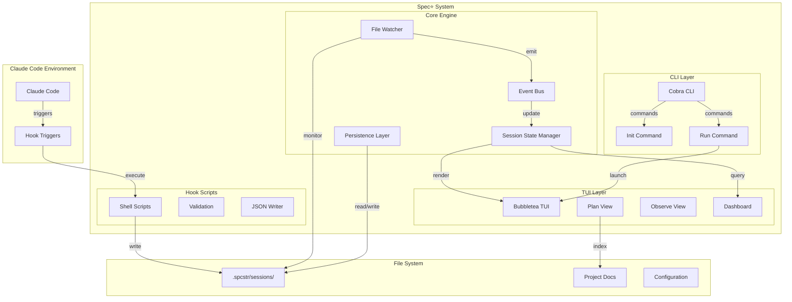
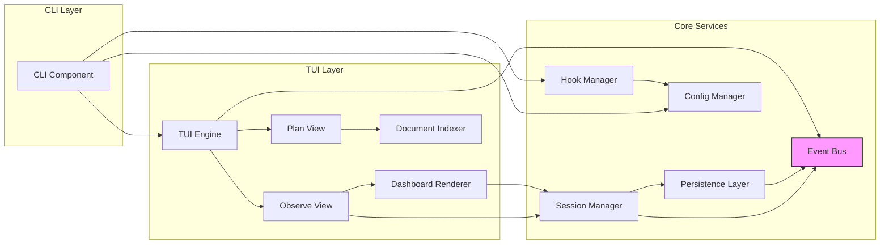
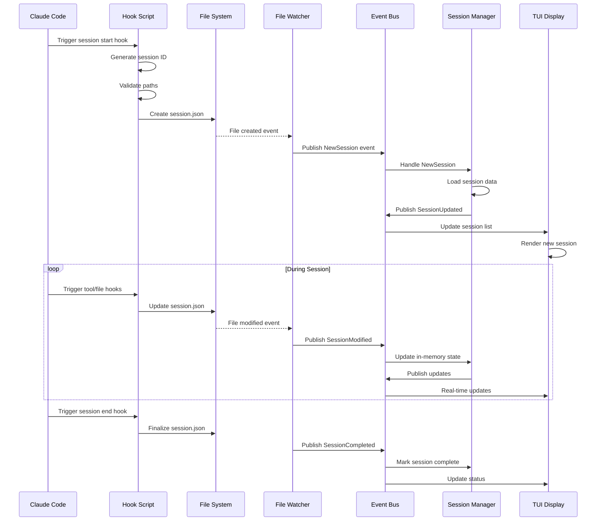
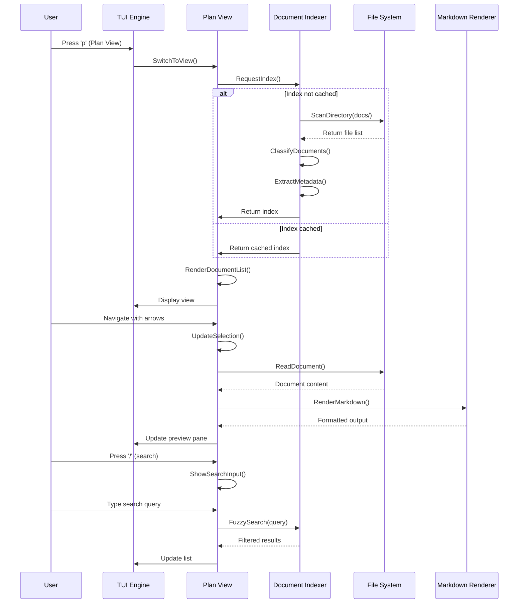
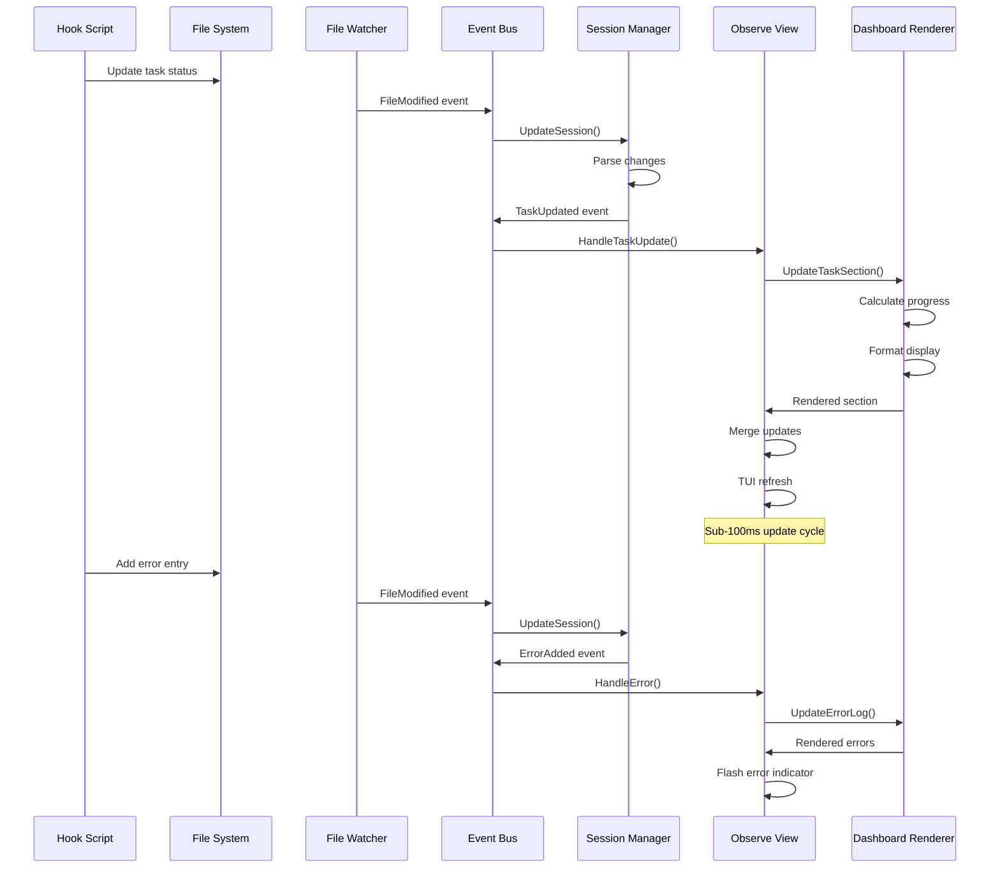
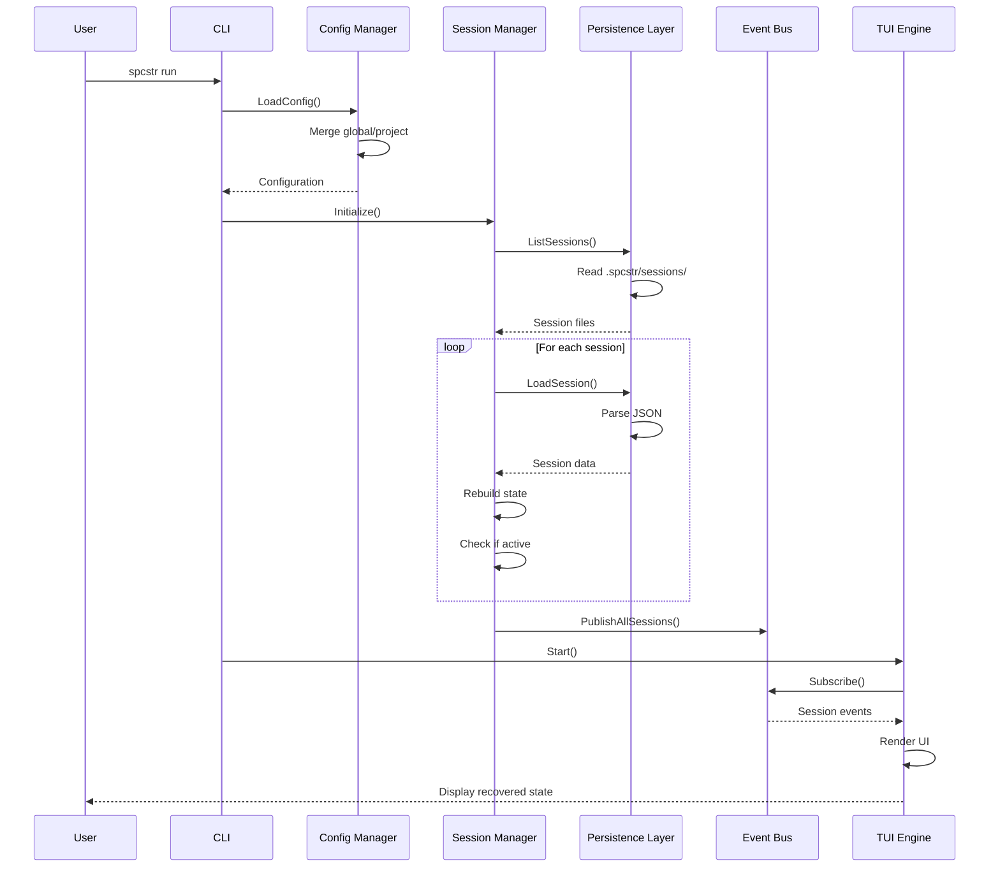
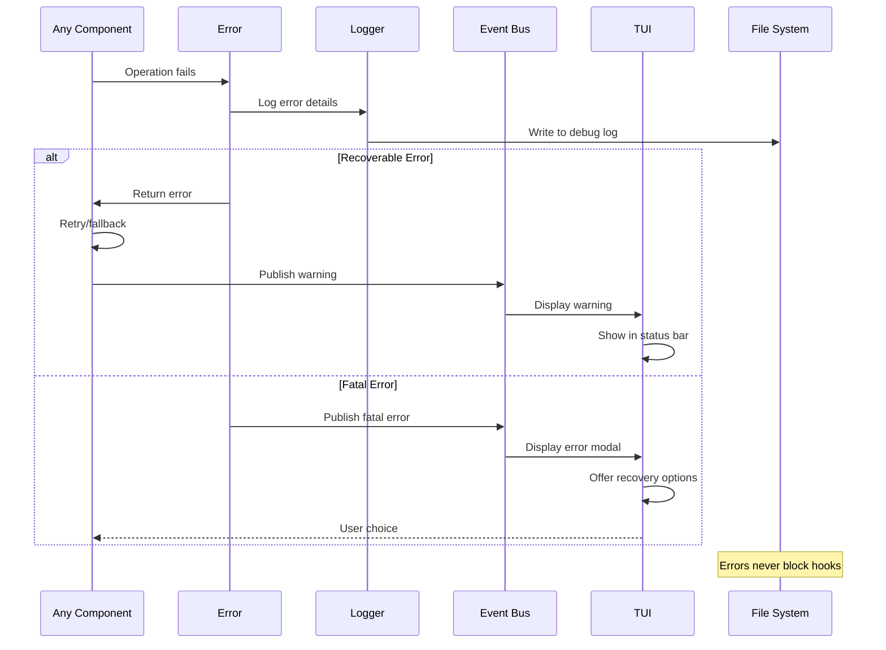

# Spec⭐️ (spcstr) Architecture Document

## Introduction

This document outlines the overall project architecture for Spec⭐️ (spcstr), including backend systems, shared services, and non-UI specific concerns. Its primary goal is to serve as the guiding architectural blueprint for AI-driven development, ensuring consistency and adherence to chosen patterns and technologies.

**Relationship to Frontend Architecture:**
If the project includes a significant user interface, a separate Frontend Architecture Document will detail the frontend-specific design and MUST be used in conjunction with this document. Core technology stack choices documented herein (see "Tech Stack") are definitive for the entire project, including any frontend components.

### Starter Template or Existing Project

Based on the PRD review, this is a greenfield Go project with no mention of starter templates. The project will use:
- Bubbletea for the TUI framework (mentioned explicitly in PRD)
- Cobra for CLI command structure
- Standard Go project structure

No existing codebase or starter template is being used - this will be built from scratch as a monolithic Go binary.

### Change Log

| Date | Version | Description | Author |
|------|---------|-------------|--------|
| 2025-09-05 | 1.0 | Initial architecture document | BMad Master |

## High Level Architecture

### Technical Summary

Spec⭐️ is a monolithic Go application utilizing an event-driven architecture for real-time session monitoring. The system combines a CLI interface built with Cobra and a responsive TUI powered by Bubbletea, with file-based JSON persistence for session state. Core architectural patterns include event sourcing for session tracking, observer pattern for real-time updates, and command pattern for CLI operations. This architecture directly supports the PRD's goals of sub-100ms responsiveness, single-binary distribution, and seamless Claude Code integration through its hook system.

### High Level Overview

1. **Architectural Style:** Event-Driven Monolith with modular package structure
2. **Repository Structure:** Monorepo containing all Go packages, hook scripts, and configurations (as specified in PRD)
3. **Service Architecture:** Single monolithic Go binary with internal modular packages for separation of concerns
4. **Primary Flow:** Claude Code hooks → Shell scripts → File system events → Go watchers → Channel-based updates → TUI rendering
5. **Key Decisions:**
   - File-based persistence over database for simplicity and portability
   - Event-driven internal architecture for real-time responsiveness
   - Channel-based communication between components for thread safety
   - Modular package design within monolith for maintainability

### High Level Project Diagram



### Architectural and Design Patterns

- **Event-Driven Architecture:** Internal event bus using Go channels for component communication - _Rationale:_ Enables real-time updates with <100ms latency as required by PRD while maintaining loose coupling
- **Observer Pattern:** File system watchers notify UI of session changes - _Rationale:_ Allows multiple UI components to react to session updates without tight coupling
- **Command Pattern:** Cobra CLI commands encapsulate operations - _Rationale:_ Provides clean separation of CLI interface from business logic, standard Go CLI practice
- **Repository Pattern:** Abstract session data access through interfaces - _Rationale:_ Enables testing with mock data and potential future migration to database if needed
- **Model-View-Update (Elm Architecture):** Bubbletea's pattern for TUI state management - _Rationale:_ Proven pattern for responsive TUIs, handles concurrent updates safely
- **Module Pattern:** Internal packages for session, ui, hooks, config domains - _Rationale:_ Maintains clean boundaries within monolith for future extraction if needed

## Tech Stack

This is the **DEFINITIVE** technology selection section. These choices will be referenced by all other documentation and AI agents.

### Cloud Infrastructure
- **Provider:** N/A - Local application
- **Key Services:** File system only
- **Deployment Regions:** N/A - Distributed as binary

### Technology Stack Table

| Category | Technology | Version | Purpose | Rationale |
|----------|------------|---------|---------|-----------|
| **Language** | Go | 1.21.0 | Primary development language | Latest stable with improved performance, required by PRD |
| **CLI Framework** | Cobra | 1.8.0 | Command-line interface | Industry standard, explicitly required in PRD |
| **TUI Framework** | Bubbletea | 0.25.0 | Terminal UI | Proven stability, explicitly required in PRD |
| **TUI Components** | Bubbles | 0.17.1 | UI components for Bubbletea | Official component library for Bubbletea |
| **TUI Styling** | Lipgloss | 0.9.1 | Terminal styling | Official styling library for Bubbletea |
| **Markdown** | Glamour | 0.6.0 | Markdown rendering in terminal | Integrates with Bubbletea ecosystem |
| **Shell Scripts** | POSIX sh | N/A | Hook scripts | Maximum compatibility as required |
| **File Watching** | fsnotify | 1.7.0 | File system events | Production-proven, cross-platform |
| **Testing** | Go testing | stdlib | Unit tests | Standard Go testing package |
| **Testing Mock** | testify | 1.8.4 | Test assertions and mocks | Most popular Go testing toolkit |
| **Linting** | golangci-lint | 1.55.0 | Code quality | Comprehensive Go linter |
| **Build Tool** | Make | N/A | Build automation | Standard, mentioned in PRD stories |
| **Module Mgmt** | Go Modules | 1.21.0 | Dependency management | Standard Go dependency system |
| **JSON** | encoding/json | stdlib | Session persistence | Explicitly required, standard library |
| **Config Format** | JSON | N/A | Configuration files | Consistency with session format |
| **Fuzzy Search** | fuzzy | 1.0.0 | Document search in Plan View | Lightweight fuzzy matching |

## Data Models

### Session Model
**Purpose:** Represents a complete Claude Code session from start to finish

**Key Attributes:**
- SessionID: string - Unique identifier for the session
- Status: enum(active, completed, error) - Current session state
- StartTime: timestamp - When session began
- EndTime: timestamp - When session completed (nullable)
- ProjectPath: string - Absolute path to project directory
- Metadata: map[string]string - Additional session context

**Relationships:**
- Has many Agents (1-to-many)
- Has many Tasks (1-to-many)
- Has many FileOperations (1-to-many)
- Has many ToolExecutions (1-to-many)
- Has many Errors (1-to-many)

### Agent Model
**Purpose:** Represents an AI agent participating in the session

**Key Attributes:**
- AgentID: string - Unique identifier
- Name: string - Agent display name
- Type: string - Agent type (e.g., "dev", "architect")
- Status: enum(idle, active, error) - Current agent state
- LastActivity: timestamp - Last action timestamp
- SessionID: string - Parent session reference

**Relationships:**
- Belongs to Session (many-to-1)
- Has many Tasks (1-to-many)

### Task Model
**Purpose:** Tracks individual tasks within a session

**Key Attributes:**
- TaskID: string - Unique identifier
- Content: string - Task description
- Status: enum(pending, in_progress, completed) - Task state
- CreatedAt: timestamp - Task creation time
- CompletedAt: timestamp - Task completion time (nullable)
- AgentID: string - Assigned agent reference

**Relationships:**
- Belongs to Session (many-to-1)
- Belongs to Agent (many-to-1)

### FileOperation Model
**Purpose:** Records file system operations performed during session

**Key Attributes:**
- OperationID: string - Unique identifier
- FilePath: string - Absolute file path
- Operation: enum(created, edited, read, deleted) - Operation type
- Timestamp: timestamp - When operation occurred
- SessionID: string - Parent session reference
- LineCount: int - Number of lines affected (optional)

**Relationships:**
- Belongs to Session (many-to-1)

### ToolExecution Model
**Purpose:** Tracks tool/command executions

**Key Attributes:**
- ExecutionID: string - Unique identifier
- ToolName: string - Name of tool executed
- Command: string - Full command or parameters
- Timestamp: timestamp - Execution time
- Duration: int - Execution duration in milliseconds
- ExitCode: int - Command exit code (nullable)
- SessionID: string - Parent session reference

**Relationships:**
- Belongs to Session (many-to-1)

### PlanDocument Model
**Purpose:** Represents indexed planning documents (PRD, Architecture, etc.)

**Key Attributes:**
- DocumentID: string - Unique identifier
- FilePath: string - Absolute path to document
- Type: enum(prd, architecture, epic, story, config) - Document classification
- Title: string - Extracted document title
- LastModified: timestamp - File modification time
- Content: string - Cached content for search
- Metadata: map[string]string - Extracted frontmatter or metadata

**Relationships:**
- Independent entity (used by Plan View)

### Configuration Model
**Purpose:** Stores application and project configuration

**Key Attributes:**
- ConfigID: string - Unique identifier
- Scope: enum(global, project) - Configuration scope
- HooksPath: string - Path to hook scripts
- SessionsPath: string - Path to session storage
- DocsPath: []string - Paths to scan for documents
- UIPreferences: map[string]interface{} - UI settings
- Version: string - Config schema version

**Relationships:**
- Independent entity (singleton per scope)

## Components

### CLI Component
**Responsibility:** Command-line interface and entry point for all operations

**Key Interfaces:**
- `spcstr init` - Initialize project with hooks and configuration
- `spcstr run` - Launch TUI application
- `spcstr config` - View/edit configuration
- `spcstr version` - Display version information

**Dependencies:** Cobra framework, Config Manager, Hook Manager

**Technology Stack:** Cobra 1.8.0 for CLI structure, Go 1.21.0

### Hook Manager Component
**Responsibility:** Generate, validate, and install Claude Code hook scripts

**Key Interfaces:**
- GenerateHooks() - Create POSIX-compliant shell scripts
- InstallHooks() - Write hooks to .spcstr/hooks/
- UpdateClaudeSettings() - Modify Claude's settings.json

**Dependencies:** Config Manager, File System utilities

**Technology Stack:** Go templates for script generation, encoding/json for settings

### Session Manager Component
**Responsibility:** Manage session lifecycle and state persistence

**Key Interfaces:**
- CreateSession() - Initialize new session
- UpdateSession() - Modify session state
- LoadSession() - Read session from disk
- ListSessions() - Query all sessions
- WatchSessions() - Monitor for changes

**Dependencies:** Persistence Layer, Event Bus

**Technology Stack:** encoding/json for serialization, fsnotify 1.7.0 for watching

### Event Bus Component
**Responsibility:** Coordinate real-time updates between components using channels

**Key Interfaces:**
- Subscribe(topic) - Register for event notifications
- Publish(event) - Emit events to subscribers
- Unsubscribe() - Remove event listener

**Dependencies:** None (core infrastructure)

**Technology Stack:** Go channels, context for cancellation

### Persistence Layer Component
**Responsibility:** Abstract file system operations for session data

**Key Interfaces:**
- Read() - Load JSON from file
- Write() - Save JSON to file
- Delete() - Remove session file
- List() - Enumerate session files
- Watch() - Monitor directory changes

**Dependencies:** File System

**Technology Stack:** encoding/json, os/filepath, fsnotify 1.7.0

### TUI Engine Component
**Responsibility:** Core terminal UI management and view orchestration

**Key Interfaces:**
- Run() - Start TUI event loop
- SwitchView() - Change active view
- HandleKeypress() - Process global keybindings
- Resize() - Handle terminal resize

**Dependencies:** Plan View, Observe View, Event Bus

**Technology Stack:** Bubbletea 0.25.0, Lipgloss 0.9.1

### Plan View Component
**Responsibility:** Document indexing, search, and markdown preview

**Key Interfaces:**
- IndexDocuments() - Scan and catalog markdown files
- SearchDocuments() - Fuzzy search across documents
- RenderMarkdown() - Display formatted markdown
- NavigateDocuments() - Handle document selection

**Dependencies:** Document Indexer, Markdown Renderer

**Technology Stack:** Glamour 0.6.0 for markdown, fuzzy 1.0.0 for search

### Observe View Component
**Responsibility:** Session list and real-time dashboard display

**Key Interfaces:**
- RenderSessionList() - Display active/completed sessions
- RenderDashboard() - Show session details
- HandleSelection() - Process session selection
- UpdateMetrics() - Refresh real-time data

**Dependencies:** Session Manager, Dashboard Renderer

**Technology Stack:** Bubbletea 0.25.0, Bubbles 0.17.1 components

### Dashboard Renderer Component
**Responsibility:** Layout and render session details in organized sections

**Key Interfaces:**
- RenderAgents() - Display agent status section
- RenderTasks() - Show task progress
- RenderFiles() - List file operations
- RenderTools() - Display tool usage metrics
- RenderErrors() - Show error log

**Dependencies:** Session Manager

**Technology Stack:** Lipgloss 0.9.1 for styling, Bubbles 0.17.1 for components

### Document Indexer Component
**Responsibility:** Recursively scan and index planning documents

**Key Interfaces:**
- ScanDirectory() - Recursive markdown discovery
- ClassifyDocument() - Determine document type
- ExtractMetadata() - Parse frontmatter/headers
- BuildIndex() - Create searchable index

**Dependencies:** File System

**Technology Stack:** Go stdlib, regexp for parsing

### Config Manager Component
**Responsibility:** Manage global and project configuration with XDG compliance

**Key Interfaces:**
- LoadConfig() - Read configuration from disk
- SaveConfig() - Persist configuration changes
- MergeConfigs() - Combine global and project settings
- ValidateConfig() - Ensure configuration integrity

**Dependencies:** File System

**Technology Stack:** encoding/json, XDG base directory spec

### Component Diagrams



## External APIs

Based on the PRD requirements and component design, this project does **not require any external API integrations**. Spec⭐️ is a completely local, self-contained terminal application that:

- Integrates with Claude Code through local file system hooks only
- Uses file-based persistence without any cloud storage
- Has no network dependencies or external service calls
- Operates entirely within the local development environment

All interactions are with:
- Local file system for session persistence
- Local shell scripts for Claude Code hooks
- Local markdown documents for Plan View
- Local configuration files

This design aligns with the PRD's goals of creating a single-binary tool with no runtime dependencies and ensures the application works offline without any external service requirements.

## Core Workflows

### Session Creation and Tracking Workflow


### Plan View Document Discovery Workflow


### Real-time Dashboard Update Workflow


### Session Recovery on Restart Workflow


### Error Handling Flow


## REST API Spec

Based on the PRD and architecture, **Spec⭐️ does not include a REST API**. This is a terminal-based CLI/TUI application that:

- Operates entirely through command-line interface (Cobra CLI)
- Provides user interaction through terminal UI (Bubbletea)
- Integrates with Claude Code via file system hooks, not HTTP
- Uses file-based persistence, not network APIs

The application follows a different architectural pattern:
- **CLI Commands** instead of REST endpoints
- **File system events** instead of HTTP requests
- **TUI interactions** instead of web responses
- **Shell scripts** for external integration

## Database Schema

Since Spec⭐️ uses **file-based JSON persistence** rather than a traditional database, here are the JSON schemas for our data structures:

### Session Schema (`.spcstr/sessions/{session-id}.json`)
```json
{
  "$schema": "http://json-schema.org/draft-07/schema#",
  "type": "object",
  "required": ["sessionID", "status", "startTime", "projectPath"],
  "properties": {
    "sessionID": {
      "type": "string",
      "pattern": "^[a-zA-Z0-9-]+$"
    },
    "status": {
      "type": "string",
      "enum": ["active", "completed", "error"]
    },
    "startTime": {
      "type": "string",
      "format": "date-time"
    },
    "endTime": {
      "type": ["string", "null"],
      "format": "date-time"
    },
    "projectPath": {
      "type": "string"
    },
    "metadata": {
      "type": "object",
      "additionalProperties": {"type": "string"}
    },
    "agents": {
      "type": "array",
      "items": {
        "type": "object",
        "required": ["agentID", "name", "type", "status"],
        "properties": {
          "agentID": {"type": "string"},
          "name": {"type": "string"},
          "type": {"type": "string"},
          "status": {
            "type": "string",
            "enum": ["idle", "active", "error"]
          },
          "lastActivity": {
            "type": "string",
            "format": "date-time"
          }
        }
      }
    },
    "tasks": {
      "type": "array",
      "items": {
        "type": "object",
        "required": ["taskID", "content", "status", "createdAt"],
        "properties": {
          "taskID": {"type": "string"},
          "content": {"type": "string"},
          "status": {
            "type": "string",
            "enum": ["pending", "in_progress", "completed"]
          },
          "createdAt": {
            "type": "string",
            "format": "date-time"
          },
          "completedAt": {
            "type": ["string", "null"],
            "format": "date-time"
          },
          "agentID": {"type": "string"}
        }
      }
    },
    "fileOperations": {
      "type": "array",
      "items": {
        "type": "object",
        "required": ["operationID", "filePath", "operation", "timestamp"],
        "properties": {
          "operationID": {"type": "string"},
          "filePath": {"type": "string"},
          "operation": {
            "type": "string",
            "enum": ["created", "edited", "read", "deleted"]
          },
          "timestamp": {
            "type": "string",
            "format": "date-time"
          },
          "lineCount": {"type": "integer"}
        }
      }
    },
    "toolExecutions": {
      "type": "array",
      "items": {
        "type": "object",
        "required": ["executionID", "toolName", "timestamp"],
        "properties": {
          "executionID": {"type": "string"},
          "toolName": {"type": "string"},
          "command": {"type": "string"},
          "timestamp": {
            "type": "string",
            "format": "date-time"
          },
          "duration": {"type": "integer"},
          "exitCode": {"type": ["integer", "null"]}
        }
      }
    },
    "errors": {
      "type": "array",
      "items": {
        "type": "object",
        "required": ["errorID", "message", "timestamp"],
        "properties": {
          "errorID": {"type": "string"},
          "message": {"type": "string"},
          "timestamp": {
            "type": "string",
            "format": "date-time"
          },
          "severity": {
            "type": "string",
            "enum": ["warning", "error", "fatal"]
          },
          "context": {"type": "object"}
        }
      }
    }
  }
}
```

### Configuration Schema (`.spcstr/config.json`)
```json
{
  "$schema": "http://json-schema.org/draft-07/schema#",
  "type": "object",
  "required": ["version", "scope"],
  "properties": {
    "version": {
      "type": "string",
      "pattern": "^\\d+\\.\\d+\\.\\d+$"
    },
    "scope": {
      "type": "string",
      "enum": ["global", "project"]
    },
    "paths": {
      "type": "object",
      "properties": {
        "hooks": {"type": "string"},
        "sessions": {"type": "string"},
        "docs": {
          "type": "array",
          "items": {"type": "string"}
        }
      }
    },
    "ui": {
      "type": "object",
      "properties": {
        "theme": {
          "type": "string",
          "enum": ["default", "dark", "light", "high-contrast"]
        },
        "keyBindings": {
          "type": "object",
          "additionalProperties": {"type": "string"}
        },
        "refreshRate": {
          "type": "integer",
          "minimum": 100,
          "maximum": 5000
        }
      }
    },
    "session": {
      "type": "object",
      "properties": {
        "retentionDays": {
          "type": "integer",
          "minimum": 1
        },
        "autoArchive": {"type": "boolean"},
        "maxActiveSession": {"type": "integer"}
      }
    }
  }
}
```

### Document Index Cache Schema (`.spcstr/cache/document-index.json`)
```json
{
  "$schema": "http://json-schema.org/draft-07/schema#",
  "type": "object",
  "required": ["version", "lastUpdated", "documents"],
  "properties": {
    "version": {"type": "string"},
    "lastUpdated": {
      "type": "string",
      "format": "date-time"
    },
    "documents": {
      "type": "array",
      "items": {
        "type": "object",
        "required": ["documentID", "filePath", "type", "title", "lastModified"],
        "properties": {
          "documentID": {"type": "string"},
          "filePath": {"type": "string"},
          "type": {
            "type": "string",
            "enum": ["prd", "architecture", "epic", "story", "config", "other"]
          },
          "title": {"type": "string"},
          "lastModified": {
            "type": "string",
            "format": "date-time"
          },
          "content": {"type": "string"},
          "metadata": {
            "type": "object",
            "additionalProperties": true
          },
          "searchTerms": {
            "type": "array",
            "items": {"type": "string"}
          }
        }
      }
    }
  }
}
```

### File System Layout
```
.spcstr/
├── config.json                 # Project configuration
├── sessions/                   # Session data directory
│   ├── active/                 # Active sessions
│   │   └── {session-id}.json
│   └── archive/                # Completed sessions
│       └── 2025-01-05/
│           └── {session-id}.json
├── hooks/                      # Generated hook scripts
│   ├── pre-command.sh
│   ├── post-command.sh
│   ├── file-modified.sh
│   └── session-end.sh
├── cache/                      # Application cache
│   └── document-index.json
└── logs/                       # Debug logs
    └── debug.log
```

### Index Strategies

Since we're using file-based storage, we implement indexing through:

1. **Session Index**: Directory listing with file naming convention for quick access
2. **Document Index**: Cached JSON file with pre-computed search terms
3. **Active Sessions**: Separate directory for O(1) active session queries
4. **Date-based Archive**: Directory structure for efficient historical queries

### Performance Considerations

- **Write Performance**: Atomic writes using temp file + rename
- **Read Performance**: Memory-mapped files for large sessions
- **Concurrency**: File locking for write operations
- **Caching**: In-memory cache with fsnotify invalidation
- **Compression**: Optional gzip for archived sessions

## Source Tree

```
spcstr/
├── cmd/
│   └── spcstr/
│       └── main.go                 # Application entry point
├── internal/
│   ├── cli/
│   │   ├── root.go                 # Root command setup
│   │   ├── init.go                 # Init command implementation
│   │   ├── run.go                  # Run command implementation
│   │   ├── config.go               # Config command implementation
│   │   └── version.go              # Version command
│   ├── config/
│   │   ├── config.go               # Configuration structures
│   │   ├── loader.go               # Config loading logic
│   │   ├── validator.go            # Config validation
│   │   └── xdg.go                  # XDG directory handling
│   ├── hooks/
│   │   ├── generator.go            # Hook script generation
│   │   ├── installer.go            # Hook installation logic
│   │   ├── templates.go            # Shell script templates
│   │   └── claude.go               # Claude settings updater
│   ├── session/
│   │   ├── session.go              # Session data structures
│   │   ├── manager.go              # Session lifecycle management
│   │   ├── persistence.go          # JSON read/write operations
│   │   └── watcher.go              # File system monitoring
│   ├── events/
│   │   ├── bus.go                  # Event bus implementation
│   │   ├── types.go                # Event type definitions
│   │   └── subscriber.go           # Subscription management
│   ├── tui/
│   │   ├── app.go                  # Main TUI application
│   │   ├── keys.go                 # Global keybinding definitions
│   │   ├── styles.go               # Lipgloss style definitions
│   │   └── components/
│   │       ├── help.go             # Help overlay component
│   │       ├── status.go           # Status bar component
│   │       └── input.go            # Search input component
│   ├── views/
│   │   ├── plan/
│   │   │   ├── view.go             # Plan view implementation
│   │   │   ├── document_list.go    # Document list component
│   │   │   ├── preview.go          # Markdown preview pane
│   │   │   └── modes.go            # Spec/Workflow/Config modes
│   │   └── observe/
│   │       ├── view.go             # Observe view implementation
│   │       ├── session_list.go     # Session list component
│   │       └── dashboard.go        # Dashboard layout
│   ├── dashboard/
│   │   ├── renderer.go             # Dashboard rendering engine
│   │   ├── sections.go             # Section definitions
│   │   ├── agents.go               # Agent status section
│   │   ├── tasks.go                # Task progress section
│   │   ├── files.go                # File operations section
│   │   ├── tools.go                # Tool usage metrics
│   │   └── errors.go               # Error log section
│   ├── indexer/
│   │   ├── indexer.go              # Document indexing engine
│   │   ├── scanner.go              # Directory scanner
│   │   ├── classifier.go           # Document type detection
│   │   ├── metadata.go             # Metadata extraction
│   │   └── search.go               # Fuzzy search implementation
│   └── utils/
│       ├── logger.go               # Logging utilities
│       ├── json.go                 # JSON helpers
│       ├── filepath.go             # Path manipulation
│       └── terminal.go             # Terminal utilities
├── pkg/
│   └── models/
│       ├── session.go              # Public session types
│       ├── agent.go                # Agent model
│       ├── task.go                 # Task model
│       ├── file.go                 # File operation model
│       └── document.go             # Document model
├── scripts/
│   ├── hooks/
│   │   ├── template.sh.tmpl        # Hook script template
│   │   └── common.sh               # Shared hook functions
│   ├── install.sh                  # Installation script
│   └── release.sh                  # Release build script
├── test/
│   ├── integration/
│   │   ├── cli_test.go             # CLI integration tests
│   │   ├── session_test.go         # Session management tests
│   │   └── tui_test.go             # TUI interaction tests
│   ├── fixtures/
│   │   ├── sessions/               # Test session data
│   │   └── docs/                   # Test documents
│   └── mocks/
│       ├── filesystem.go           # File system mocks
│       └── events.go               # Event bus mocks
├── docs/
│   ├── prd.md                      # Product Requirements Document
│   ├── architecture.md             # This architecture document
│   ├── frontend-spec.md            # Frontend specification
│   └── api/                        # Generated API documentation
├── .spcstr/                         # Default project config location
│   ├── config.json                 # Project configuration
│   ├── sessions/                   # Session data
│   ├── hooks/                      # Generated hooks
│   └── cache/                      # Application cache
├── go.mod                           # Go module definition
├── go.sum                           # Dependency checksums
├── Makefile                         # Build automation
├── .golangci.yml                   # Linter configuration
├── .gitignore                      # Git ignore rules
├── LICENSE                          # MIT License
└── README.md                        # Project documentation
```

## Infrastructure and Deployment

### Infrastructure as Code
- **Tool:** Make + Go Build System
- **Location:** `Makefile` and `scripts/`
- **Approach:** Build automation and cross-compilation targets for multiple platforms

### Deployment Strategy
- **Strategy:** Binary Distribution via Package Managers
- **CI/CD Platform:** GitHub Actions (recommended)
- **Pipeline Configuration:** `.github/workflows/release.yml`

### Environments
- **Development:** Local development with hot reload support via `make run`
- **Testing:** Automated test environment in CI pipeline with fixtures
- **Production:** End-user installations via Homebrew, apt, yum package managers

### Environment Promotion Flow
```
Development (local) 
    ↓ (git push)
CI/CD Pipeline
    ↓ (tests pass)
Build Artifacts
    ↓ (tag release)
GitHub Releases
    ↓ (package managers)
Production (user machines)
```

### Rollback Strategy
- **Primary Method:** Version pinning in package managers
- **Trigger Conditions:** User-reported critical bugs or data corruption
- **Recovery Time Objective:** < 1 hour via package manager update

### Build and Distribution Details

**Makefile Targets:**
```makefile
# Development
make build        # Build for current platform
make run         # Run with hot reload
make test        # Run all tests
make lint        # Run golangci-lint
make clean       # Clean build artifacts

# Release
make release     # Build for all platforms
make package     # Create distribution packages
make sign        # Sign binaries for macOS
```

**Cross-Platform Builds:**
- Linux: amd64, arm64
- macOS: amd64 (Intel), arm64 (Apple Silicon)
- Windows: amd64 (via WSL support)

**Distribution Channels:**
1. **Homebrew (macOS/Linux)**
   - Formula in homebrew-tap repository
   - Auto-update via brew upgrade

2. **APT (Debian/Ubuntu)**
   - .deb package with systemd integration
   - Repository hosting on packagecloud.io

3. **YUM (RHEL/Fedora)**
   - .rpm package
   - Repository hosting on packagecloud.io

4. **Direct Download**
   - GitHub Releases with checksums
   - Signed binaries for verification

**CI/CD Pipeline Stages:**
1. **Test Stage**
   - Unit tests with coverage
   - Integration tests
   - Linting and static analysis

2. **Build Stage**
   - Cross-compilation for all platforms
   - Version injection from git tags
   - Binary optimization with -ldflags

3. **Package Stage**
   - Platform-specific packaging
   - Checksum generation
   - Code signing (macOS)

4. **Release Stage**
   - GitHub Release creation
   - Package manager updates
   - Documentation deployment

**Version Management:**
- Semantic versioning (MAJOR.MINOR.PATCH)
- Git tags trigger release builds
- Version embedded in binary at build time

## Error Handling Strategy

### General Approach
- **Error Model:** Go's explicit error handling with wrapped errors for context
- **Exception Hierarchy:** Structured error types with error codes for classification
- **Error Propagation:** Errors bubble up with context using fmt.Errorf with %w verb

### Logging Standards
- **Library:** Standard library log/slog
- **Format:** JSON for production, text for development
- **Levels:** DEBUG, INFO, WARN, ERROR, FATAL
- **Required Context:**
  - Correlation ID: UUID per session (format: sess_{uuid})
  - Service Context: Component name and operation
  - User Context: Never log sensitive data, only session ID

### Error Handling Patterns

#### External API Errors
- **Retry Policy:** N/A - No external APIs in this application
- **Circuit Breaker:** N/A - No external services
- **Timeout Configuration:** File operations timeout after 5 seconds
- **Error Translation:** File system errors wrapped with operation context

#### Business Logic Errors
- **Custom Exceptions:** 
  ```go
  type SessionError (InvalidState, NotFound, Corrupted)
  type ConfigError (Invalid, Missing, VersionMismatch)
  type HookError (ScriptFailed, PermissionDenied)
  ```
- **User-Facing Errors:** Human-readable messages with suggested actions
- **Error Codes:** SPCSTR-XXXX format (e.g., SPCSTR-1001: Session not found)

#### Data Consistency
- **Transaction Strategy:** Atomic file writes via temp file + rename
- **Compensation Logic:** Automatic rollback on partial writes
- **Idempotency:** All hook operations are idempotent by design

### Error Categories and Handling

**Fatal Errors (Application exits):**
- Unable to access .spcstr directory
- Configuration corruption
- Terminal initialization failure
- Action: Log error, display message, exit with code 1

**Recoverable Errors (Operation retried):**
- File lock contention
- Temporary file system issues
- Action: Exponential backoff retry (3 attempts max)

**User Errors (User notification):**
- Invalid command syntax
- Missing required files
- Action: Display helpful error with usage instructions

**Warning Level (Logged but continues):**
- Outdated session files
- Missing optional configuration
- Action: Log warning, use defaults, continue operation

### Hook Script Error Handling

**Critical Requirement:** Hook scripts must NEVER block Claude Code

```bash
# Error handling in hook scripts
set +e  # Don't exit on error
operation || echo "Error: $?" >> .spcstr/logs/hook-errors.log
exit 0  # Always exit successfully
```

### TUI Error Display

**Error Notification Levels:**
1. **Status Bar Warning:** Yellow text for non-critical issues
2. **Modal Dialog:** Red border for errors requiring user action
3. **Error Section:** Persistent error log in dashboard

**Error Recovery Options:**
- Retry operation
- Skip and continue
- View detailed log
- Export error report

### Debug Logging

**Debug Log Location:** `.spcstr/logs/debug.log`

**Debug Information Captured:**
- Full stack traces for errors
- File operation details
- Event bus message flow
- Performance metrics
- Session state transitions

**Log Rotation:**
- Maximum file size: 10MB
- Keep last 3 files
- Automatic compression of old logs

## Coding Standards

**⚠️ IMPORTANT:** These standards are MANDATORY for AI agents generating code for this project. We'll keep this minimal and focused on critical project-specific rules only.

### Core Standards
- **Languages & Runtimes:** Go 1.21.0 (no other languages except POSIX shell for hooks)
- **Style & Linting:** golangci-lint with .golangci.yml configuration (gofmt, goimports, govet enabled)
- **Test Organization:** Tests in same package with _test.go suffix, integration tests in test/integration/

### Naming Conventions

| Element | Convention | Example |
|---------|------------|---------|
| Packages | lowercase, no underscores | `session`, `indexer` |
| Interfaces | PascalCase with -er suffix | `SessionManager`, `Renderer` |
| Structs | PascalCase | `SessionData`, `Config` |
| Functions/Methods | PascalCase (exported), camelCase (private) | `LoadSession()`, `parseJSON()` |
| Constants | PascalCase | `DefaultTimeout`, `MaxRetries` |
| Files | snake_case.go | `session_manager.go` |

### Critical Rules

- **Never use fmt.Print/Println in production code - use log/slog:** All output must go through structured logging
- **All file operations must use atomic writes (temp + rename):** Prevents data corruption on crash
- **Hook scripts must always exit 0:** Never block Claude Code operations
- **All errors must be wrapped with context using %w:** Enables proper error tracing
- **Session IDs must use format sess_{uuid}:** Consistent identification across system
- **Never panic in library code - return errors:** Only main() can panic on fatal errors
- **All public types must have godoc comments:** Documentation is mandatory for exported items
- **Use context.Context for cancellation in long operations:** Enables graceful shutdown

### Go-Specific Guidelines

- **Interfaces belong in consumer package, not provider:** Define interfaces where they're used
- **Prefer small interfaces (1-3 methods):** Enables better composition and testing
- **Use channels for coordination, mutexes for state:** Don't communicate by sharing memory
- **Embed types rather than inherit:** Go doesn't have inheritance, use composition

## Test Strategy and Standards

### Testing Philosophy
- **Approach:** Test-After Development with comprehensive coverage
- **Coverage Goals:** 80% for core packages, 60% for UI packages
- **Test Pyramid:** 70% unit tests, 20% integration tests, 10% manual TUI tests

### Test Types and Organization

#### Unit Tests
- **Framework:** testing (Go standard library)
- **File Convention:** {filename}_test.go in same package
- **Location:** Alongside source files
- **Mocking Library:** testify/mock 1.8.4
- **Coverage Requirement:** 80% for business logic, 60% for UI

**AI Agent Requirements:**
- Generate tests for all public methods
- Cover edge cases and error conditions
- Follow AAA pattern (Arrange, Act, Assert)
- Mock all external dependencies

#### Integration Tests
- **Scope:** End-to-end workflows, file system operations, event flow
- **Location:** test/integration/
- **Test Infrastructure:**
  - **File System:** Real temp directories via t.TempDir()
  - **Event Bus:** Real implementation with test subscribers
  - **Sessions:** Test fixtures in test/fixtures/sessions/

#### End-to-End Tests
- **Framework:** Manual testing procedures documented
- **Scope:** TUI interactions, user workflows
- **Environment:** Local development environment
- **Test Data:** Scripted session generation

### Test Data Management
- **Strategy:** Fixtures for deterministic tests, generated data for property tests
- **Fixtures:** test/fixtures/ with JSON test data
- **Factories:** Test builders for complex objects
- **Cleanup:** Automatic via t.Cleanup() and t.TempDir()

### Continuous Testing
- **CI Integration:** All unit and integration tests run on every push
- **Performance Tests:** Benchmark critical paths (session loading, indexing)
- **Security Tests:** Static analysis with gosec in CI pipeline

### Testing Patterns

**Table-Driven Tests (Preferred):**
```go
func TestSessionManager_LoadSession(t *testing.T) {
    tests := []struct {
        name    string
        path    string
        want    *Session
        wantErr bool
    }{
        {"valid session", "valid.json", &Session{...}, false},
        {"missing file", "missing.json", nil, true},
        {"invalid json", "invalid.json", nil, true},
    }
    
    for _, tt := range tests {
        t.Run(tt.name, func(t *testing.T) {
            // Test implementation
        })
    }
}
```

**Mock Usage:**
```go
type MockEventBus struct {
    mock.Mock
}

func (m *MockEventBus) Publish(event Event) error {
    args := m.Called(event)
    return args.Error(0)
}
```

**TUI Testing Approach:**
Since Bubbletea TUIs are challenging to test automatically:
1. Test business logic separately from UI
2. Test model updates without rendering
3. Manual test scripts for visual verification
4. Screenshot-based regression tests for critical views

### Test Organization Rules

1. **One test file per source file**
2. **Test package matches source package**
3. **Integration tests isolated in test/integration/**
4. **Benchmarks suffixed with _bench_test.go**
5. **Test helpers in testutil package**

### Critical Testing Requirements

- **Never skip tests in CI:** All tests must pass for merge
- **Test error paths explicitly:** Every error return must be tested
- **Use subtests for related cases:** Better test output and filtering
- **Parallel tests where safe:** Mark with t.Parallel() for speed
- **Clean up resources:** Use defer or t.Cleanup()
- **Deterministic tests only:** No random data without seed

### Performance Benchmarks

Key operations requiring benchmarks:
- Session JSON parsing/serialization
- Document indexing and search
- Event bus message throughput
- File watcher responsiveness

Benchmark format:
```go
func BenchmarkSessionManager_LoadSession(b *testing.B) {
    for i := 0; i < b.N; i++ {
        // Benchmark code
    }
}
```

## Security

**⚠️ MANDATORY:** These security requirements must be followed by all AI and human developers.

### Input Validation
- **Validation Library:** Go standard library with custom validators
- **Validation Location:** At CLI command entry points before processing
- **Required Rules:**
  - All external inputs MUST be validated
  - Validation at API boundary before processing
  - Whitelist approach preferred over blacklist

### Authentication & Authorization
- **Auth Method:** Local file system permissions only (no user auth needed)
- **Session Management:** File-based sessions with unique IDs
- **Required Patterns:**
  - Sessions identified by UUID (cryptographically secure)
  - No session sharing between projects

### Secrets Management
- **Development:** No secrets required for core functionality
- **Production:** No secrets required for core functionality
- **Code Requirements:**
  - NEVER hardcode secrets
  - Access via configuration service only
  - No secrets in logs or error messages

### API Security
- **Rate Limiting:** N/A - Local application only
- **CORS Policy:** N/A - No web interface
- **Security Headers:** N/A - Terminal application
- **HTTPS Enforcement:** N/A - No network communication

### Data Protection
- **Encryption at Rest:** Rely on OS file system encryption
- **Encryption in Transit:** N/A - No network transfer
- **PII Handling:** Never log file contents, only paths
- **Logging Restrictions:** No session content, no file contents, no user paths in logs

### Dependency Security
- **Scanning Tool:** dependabot via GitHub
- **Update Policy:** Monthly review of updates
- **Approval Process:** Security updates applied immediately, features reviewed

### Security Testing
- **SAST Tool:** gosec in CI pipeline
- **DAST Tool:** N/A - Not applicable for CLI tool
- **Penetration Testing:** N/A - Local tool only

### File System Security

**Critical Requirements:**
- **Directory Permissions:** .spcstr/ created with 0755 permissions
- **File Permissions:** Session files created with 0644 permissions
- **Path Traversal Prevention:** All paths sanitized with filepath.Clean()
- **Symlink Handling:** Do not follow symlinks outside project root
- **Temp File Security:** Use os.CreateTemp() with proper permissions

### Shell Script Security

**Hook Script Requirements:**
- **Input Sanitization:** Quote all variables in shell scripts
- **Command Injection Prevention:** Never use eval or backticks
- **Environment Variables:** Clear sensitive vars before execution
- **Script Permissions:** Hook scripts created with 0755 permissions

Example safe hook script:
```bash
#!/bin/sh
set -euo pipefail
SESSION_ID="$1"  # Always quoted
PROJECT_PATH="$2"  # Always quoted

# Validate inputs
if [ -z "${SESSION_ID}" ] || [ -z "${PROJECT_PATH}" ]; then
    exit 0  # Silent failure
fi

# Safe file write
printf '{"sessionId":"%s","path":"%s"}\n' \
    "${SESSION_ID}" "${PROJECT_PATH}" >> ".spcstr/sessions/${SESSION_ID}.json"
```

### Terminal Security

**TUI Security Measures:**
- **Escape Sequence Sanitization:** Strip ANSI codes from user input
- **Buffer Overflow Prevention:** Limit input field lengths
- **Screen Scraping Protection:** No sensitive data displayed persistently
- **Clipboard Security:** No automatic clipboard operations

### Supply Chain Security

**Build Security:**
- **Reproducible Builds:** Vendor dependencies with go mod vendor
- **Build Environment:** Clean CI environment for releases
- **Binary Signing:** macOS code signing for notarization
- **Checksum Verification:** SHA256 checksums for all releases

## Checklist Results Report

*To be populated after PM checklist execution*

## Next Steps

### Next Steps for Spec⭐️ Development

Since this project has a TUI interface (not a traditional web UI), the next steps are:

1. **For Development Team:**
   - Review this architecture with stakeholders
   - Set up the Go development environment with specified versions
   - Begin implementation with Epic 1: Foundation & Core Infrastructure
   - Use Dev agent with this architecture as reference

2. **For Project Setup:**
   - Initialize Go module with `go mod init github.com/[org]/spcstr`
   - Create the directory structure as specified
   - Set up GitHub repository with CI/CD workflows
   - Configure linting and testing tools

3. **For Implementation:**
   - Start with Story 1.1: Project Setup and CLI Structure
   - Implement core components in order of dependencies
   - Write tests alongside implementation following test strategy

Note: No separate Frontend Architecture document is needed since this is a terminal-based application using Bubbletea for the TUI.