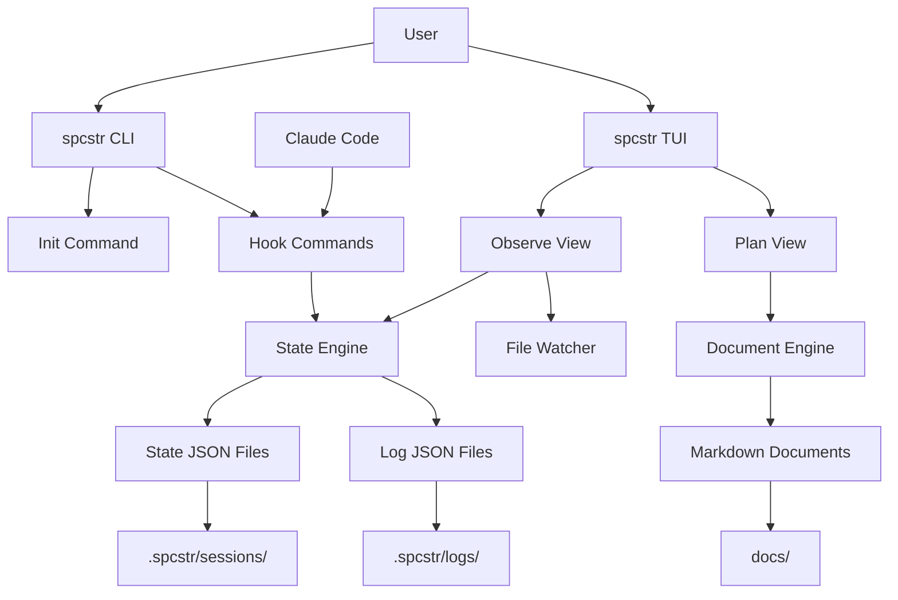
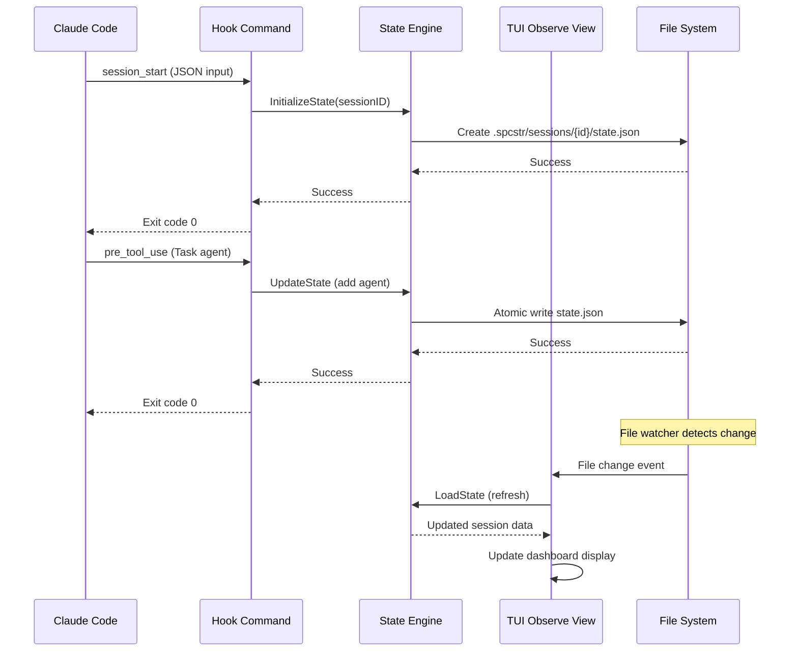
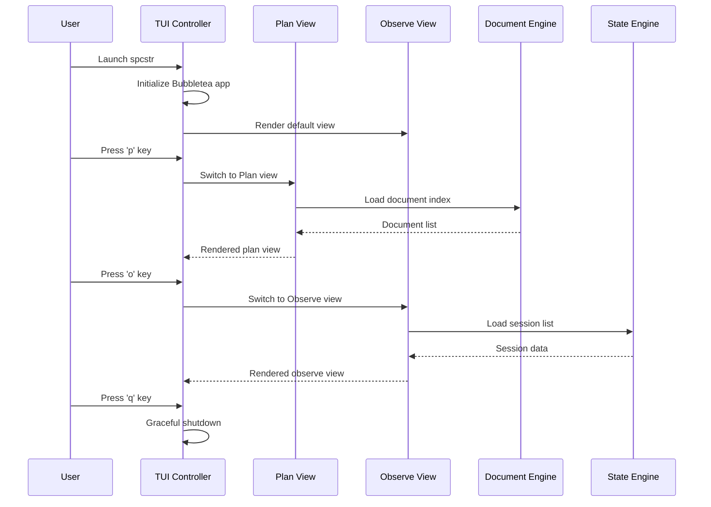
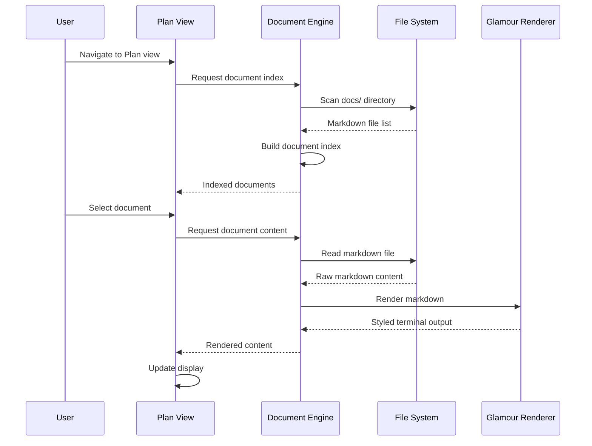
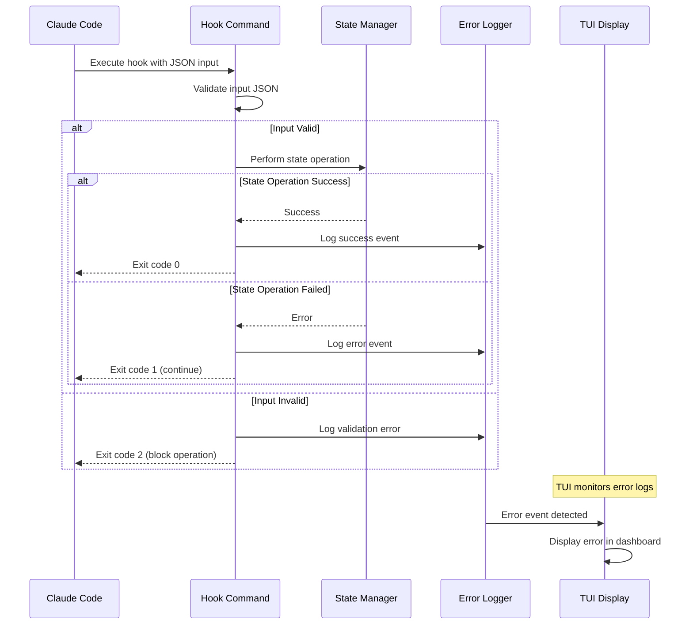

# spcstr Fullstack Architecture Document

## Introduction

This document outlines the complete fullstack architecture for spcstr, a TUI observability tool for Claude Code sessions written in Go. It serves as the single source of truth for AI-driven development, ensuring consistency across the entire technology stack.

This specialized architecture adapts traditional fullstack concepts to a CLI/TUI application that combines real-time session monitoring, embedded hook functionality, and document browsing in a single Go binary.

### Starter Template or Existing Project

N/A - Greenfield project designed as a specialized Go CLI/TUI application with embedded hook system for Claude Code integration.

### Change Log

| Date | Version | Description | Author |
|------|---------|-------------|--------|
| 2025-09-05 | v1.0 | Initial architecture document | Assistant |

## High Level Architecture

### Technical Summary

The spcstr architecture follows a single-binary monolithic design with embedded hook functionality, combining CLI commands, TUI interface, and real-time file-based observability. The frontend TUI is built with Bubbletea and Lipgloss for cross-platform terminal rendering, while the backend logic handles atomic JSON state management and hook command execution. Integration occurs through filesystem-based communication using `.spcstr/` directory structure with real-time file watching via fsnotify. The system deploys as platform-specific binaries distributed through package managers, eliminating network dependencies while providing comprehensive Claude Code session observability.

### Platform and Infrastructure Choice

**Platform:** Local Development/CLI Distribution  
**Key Services:** Package managers (Homebrew, APT, Pacman), GitHub Releases, Goreleaser  
**Deployment Host and Regions:** Local filesystem - no hosting required

### Repository Structure

**Structure:** Go monorepo with single binary output  
**Monorepo Tool:** Standard Go modules - no additional tooling needed  
**Package Organization:** Clean separation via `cmd/` for binaries and `internal/` for shared packages

### High Level Architecture Diagram



### Architectural Patterns

- **Single Binary Architecture:** All functionality embedded in one executable - _Rationale:_ Eliminates distribution complexity and ensures consistent hook execution environment
- **Event-Driven State Management:** Hook-based updates with atomic file operations - _Rationale:_ Provides reliable session tracking without database dependencies
- **Component-Based TUI:** Reusable Bubbletea components with clear separation - _Rationale:_ Maintains clean code organization for complex terminal interfaces
- **Filesystem-First Integration:** JSON files as primary data persistence - _Rationale:_ Ensures privacy, offline operation, and cross-platform compatibility
- **Real-time Observer Pattern:** File watching with automatic UI updates - _Rationale:_ Provides immediate feedback during active Claude Code sessions

## Tech Stack

### Technology Stack Table

| Category | Technology | Version | Purpose | Rationale |
|----------|------------|---------|---------|-----------|
| Primary Language | Go | 1.21+ | CLI/TUI application development | Memory safety, cross-platform binaries, excellent CLI ecosystem |
| TUI Framework | Bubbletea | v0.25+ | Terminal user interface | Industry standard for Go TUI apps with excellent event handling |
| UI Styling | Lipgloss | v0.9+ | Terminal styling and layout | Seamless integration with Bubbletea for consistent visual design |
| Markdown Rendering | Glamour | v0.6+ | Document display with syntax highlighting | Rich markdown rendering in terminal environments |
| CLI Framework | Cobra | v1.8+ | Command structure and hook subcommands | Standard Go CLI framework with excellent subcommand support |
| File Watching | fsnotify | v1.7+ | Real-time file system monitoring | Cross-platform file watching for live TUI updates |
| JSON Processing | Standard Library | Go 1.21+ | State serialization and parsing | Built-in JSON support eliminates external dependencies |
| Atomic Operations | Standard Library | Go 1.21+ | Safe concurrent file operations | Native filesystem atomicity through temp file + rename |
| Testing Framework | Go Testing | Go 1.21+ | Unit and integration testing | Built-in testing with table-driven test patterns |
| Build System | Standard Go Build | Go 1.21+ | Binary compilation | Native Go build tools with cross-compilation support |
| Release Automation | Goreleaser | v1.21+ | Multi-platform binary distribution | Automated releases to package managers and GitHub |
| Version Control | Git | 2.40+ | Source code management | Standard version control with GitHub integration |

## Data Models

### SessionState

**Purpose:** Core session tracking data structure shared between hooks and TUI

**Key Attributes:**
- session_id: string - Unique identifier for Claude Code session
- created_at: time.Time - Session initialization timestamp
- updated_at: time.Time - Last modification timestamp
- session_active: bool - Current session status flag
- agents: []string - Currently executing agents
- agents_history: []AgentExecution - Complete agent execution log

#### TypeScript Interface
```typescript
interface SessionState {
  session_id: string;
  created_at: string; // ISO8601
  updated_at: string; // ISO8601
  session_active: boolean;
  agents: string[];
  agents_history: AgentExecution[];
  files: FileOperations;
  tools_used: Record<string, number>;
  errors: ErrorEntry[];
  prompts: PromptEntry[];
  notifications: NotificationEntry[];
}

interface AgentExecution {
  name: string;
  started_at: string; // ISO8601
  completed_at?: string; // ISO8601
}

interface FileOperations {
  new: string[];
  edited: string[];
  read: string[];
}
```

#### Relationships
- One-to-many with LogEntry (session has multiple log events)
- Aggregates multiple FileOperations for comprehensive tracking
- Contains multiple AgentExecution records for multi-agent sessions

### DocumentIndex

**Purpose:** Document discovery and navigation for Plan view

**Key Attributes:**
- path: string - Absolute file path to markdown document
- title: string - Extracted document title
- type: DocumentType - Category (PRD, Architecture, Epic, Story)
- modified_at: time.Time - File modification timestamp

#### TypeScript Interface
```typescript
interface DocumentIndex {
  path: string;
  title: string;
  type: 'prd' | 'architecture' | 'epic' | 'story';
  modified_at: string; // ISO8601
}
```

#### Relationships
- Grouped by DocumentType for hierarchical navigation
- Links to actual markdown files in docs/ directory

### HookEvent

**Purpose:** Individual hook execution tracking for comprehensive logging

**Key Attributes:**
- timestamp: time.Time - Event occurrence time
- session_id: string - Associated session identifier
- hook_name: string - Which hook generated the event
- input_data: interface{} - Raw hook input parameters
- success: bool - Execution success status

#### TypeScript Interface
```typescript
interface HookEvent {
  timestamp: string; // ISO8601
  session_id: string;
  hook_name: string;
  input_data: Record<string, any>;
  success: boolean;
}
```

#### Relationships
- Many-to-one with SessionState (multiple events per session)
- Aggregated for activity timeline in Observe view

## API Specification

*No external API - This is a local CLI/TUI application. All communication occurs through:*

1. **Hook Command Interface:** Claude Code → `spcstr hook <name>` via stdin/stdout
2. **File System Interface:** JSON state files and log files
3. **Internal Go Interfaces:** Between TUI, state engine, and hook handlers

### Internal Command Interface

```go
// Hook command signature
type HookHandler func(input []byte) error

// State management interface
type StateManager interface {
    InitializeState(sessionID string) error
    LoadState(sessionID string) (*SessionState, error)
    UpdateState(sessionID string, updates StateUpdate) error
}

// TUI component interface
type TUIComponent interface {
    Update(msg tea.Msg) (tea.Model, tea.Cmd)
    View() string
}
```

## Components

### CLI Command Handler

**Responsibility:** Process command-line arguments and route to appropriate subsystems

**Key Interfaces:**
- Cobra root command with subcommands (init, version, config, tui, hook)
- Hook subcommand routing to individual hook handlers
- Configuration management for `.spcstr/` setup

**Dependencies:** Cobra framework, State Manager, Hook System

**Technology Stack:** Cobra CLI framework with embedded hook logic

### State Engine

**Responsibility:** Atomic state management for session tracking and persistence

**Key Interfaces:**
- SessionState CRUD operations with atomic write guarantees
- JSON serialization/deserialization with validation
- File system operations with error handling

**Dependencies:** Standard library (os, json), atomic file operations

**Technology Stack:** Go standard library with custom atomic write implementation

### TUI Application

**Responsibility:** Interactive terminal interface with real-time updates

**Key Interfaces:**
- Bubbletea model/update/view pattern implementation
- Component switching between Plan and Observe views
- Keyboard event handling and navigation

**Dependencies:** Bubbletea, Lipgloss, Glamour, File Watcher, State Engine

**Technology Stack:** Bubbletea framework with Lipgloss styling and Glamour rendering

### Hook System

**Responsibility:** Claude Code integration via executable hook commands

**Key Interfaces:**
- Standard input JSON parsing for hook parameters
- Exit code management (0=success, 2=block operation)
- State updates triggered by Claude Code events

**Dependencies:** State Engine, JSON parsing, Standard I/O

**Technology Stack:** Go standard library with JSON processing

### File Watcher

**Responsibility:** Real-time file system monitoring for TUI updates

**Key Interfaces:**
- fsnotify integration for `.spcstr/` directory monitoring
- Event filtering for relevant state file changes
- Bubbletea command generation for UI updates

**Dependencies:** fsnotify library, TUI Application

**Technology Stack:** fsnotify cross-platform file watching

### Document Engine

**Responsibility:** Markdown document discovery and rendering for Plan view

**Key Interfaces:**
- File system scanning for markdown documents
- Glamour markdown rendering with syntax highlighting
- Document indexing and caching

**Dependencies:** Glamour renderer, file system operations

**Technology Stack:** Glamour markdown rendering with file system integration

## External APIs

*No external APIs required - spcstr is designed as a completely offline, privacy-preserving tool.*

All integration occurs through:
- **Claude Code:** Via hook command execution (local process spawning)
- **File System:** Direct file operations for state and document management
- **Package Managers:** For distribution only (brew, apt, pacman)

## Core Workflows

### Session Tracking Workflow



### TUI Navigation Workflow



### Document Browser Workflow



## Database Schema

*No traditional database - All data persisted as JSON files*

### File System Schema

```
.spcstr/
├── sessions/                    # Session state directory
│   └── {session-id}/
│       └── state.json          # SessionState structure
└── logs/                       # Hook execution logs
    ├── session_start.json      # Array of session start events
    ├── user_prompt_submit.json # Array of prompt events
    ├── pre_tool_use.json       # Array of tool invocation events
    ├── post_tool_use.json      # Array of tool completion events
    ├── notification.json       # Array of notification events
    ├── pre_compact.json        # Array of compaction events
    ├── session_end.json        # Array of session end events
    ├── stop.json              # Array of stop events
    └── subagent_stop.json     # Array of subagent stop events
```

### JSON Schema Examples

**state.json structure:**
```json
{
  "session_id": "claude_session_20250905_143022",
  "created_at": "2025-09-05T14:30:22Z",
  "updated_at": "2025-09-05T14:35:15Z",
  "session_active": true,
  "agents": ["research-agent"],
  "agents_history": [
    {
      "name": "research-agent",
      "started_at": "2025-09-05T14:32:10Z"
    }
  ],
  "files": {
    "new": ["/project/src/main.go"],
    "edited": ["/project/README.md"],
    "read": ["/project/go.mod"]
  },
  "tools_used": {
    "Read": 3,
    "Write": 1,
    "Task": 1
  },
  "errors": [],
  "prompts": [
    {
      "timestamp": "2025-09-05T14:30:25Z",
      "prompt": "Create a Go CLI application"
    }
  ],
  "notifications": []
}
```

**Log file structure (append-only arrays):**
```json
[
  {
    "timestamp": "2025-09-05T14:30:22Z",
    "session_id": "claude_session_20250905_143022",
    "source": "startup"
  },
  {
    "timestamp": "2025-09-05T15:20:15Z",
    "session_id": "claude_session_20250905_152010",
    "source": "resume"
  }
]
```

## Frontend Architecture

### Component Architecture

#### Component Organization
```
internal/tui/
├── app/                        # Main application controller
│   └── app.go                 # Bubbletea app initialization
├── components/                 # Reusable UI components
│   ├── header/                # Header bar component
│   ├── footer/                # Footer/status bar component
│   ├── list/                  # Generic list component
│   └── dashboard/             # Session dashboard component
├── views/                     # Main view implementations
│   ├── plan/                  # Plan view (document browser)
│   └── observe/               # Observe view (session monitor)
├── styles/                    # Lipgloss styling definitions
│   └── theme.go              # Color scheme and layout styles
└── messages/                  # Custom Bubbletea messages
    └── events.go             # File change and update events
```

#### Component Template
```go
// Standard Bubbletea component pattern
type Component struct {
    width  int
    height int
    styles lipgloss.Style
    // Component-specific fields
}

func NewComponent() Component {
    return Component{
        styles: styles.DefaultComponent(),
    }
}

func (c Component) Init() tea.Cmd {
    return nil
}

func (c Component) Update(msg tea.Msg) (tea.Model, tea.Cmd) {
    switch msg := msg.(type) {
    case tea.WindowSizeMsg:
        c.width = msg.Width
        c.height = msg.Height
    case tea.KeyMsg:
        return c.handleKeys(msg)
    }
    return c, nil
}

func (c Component) View() string {
    return c.styles.Render("Component content")
}
```

### State Management Architecture

#### State Structure
```go
// TUI application state (separate from session state)
type AppState struct {
    currentView    ViewType      // plan, observe
    planState     *PlanState    // Plan view state
    observeState  *ObserveState // Observe view state
    windowSize    tea.WindowSizeMsg
    initialized   bool
}

type PlanState struct {
    documents     []DocumentIndex
    selected      int
    content       string
    focusedPane   PaneType // list, content
}

type ObserveState struct {
    sessions      []SessionState
    selected      int
    dashboard     DashboardData
    lastUpdate    time.Time
}
```

#### State Management Patterns
- **Centralized App State:** Single AppState struct manages all TUI state
- **View-Specific State:** Each view maintains its own subset of state
- **Immutable Updates:** State changes create new state objects
- **Event-Driven Updates:** File watcher events trigger state refreshes
- **Local State Only:** No persistence of TUI state between runs

### Routing Architecture

#### Route Organization
```
TUI Navigation Routes (key bindings):
├── Global Keys
│   ├── 'p' → Plan View
│   ├── 'o' → Observe View  
│   └── 'q' → Quit Application
├── Plan View Keys
│   ├── 'tab' → Switch Pane Focus
│   ├── '↑/↓' → Navigate Document List
│   ├── 'enter' → Select Document
│   └── 's/w/c' → Switch Modes (minimal for MVP)
└── Observe View Keys
    ├── '↑/↓' → Navigate Session List
    ├── 'enter' → Select Session
    └── 'r' → Manual Refresh
```

#### Navigation Pattern
```go
// Key handler routing pattern
func (a App) handleGlobalKeys(msg tea.KeyMsg) (tea.Model, tea.Cmd) {
    switch msg.String() {
    case "p":
        a.currentView = PlanView
        return a, nil
    case "o":
        a.currentView = ObserveView
        return a, tea.Cmd(loadSessions)
    case "q":
        return a, tea.Quit
    }
    
    // Route to view-specific handlers
    switch a.currentView {
    case PlanView:
        return a.planView.Update(msg)
    case ObserveView:
        return a.observeView.Update(msg)
    }
    
    return a, nil
}
```

### TUI Services Layer

#### File Watching Service
```go
// File watcher integration for real-time updates
type FileWatcherService struct {
    watcher   *fsnotify.Watcher
    eventChan chan FileChangeEvent
}

func (f *FileWatcherService) WatchStateFiles() tea.Cmd {
    return tea.Tick(time.Millisecond*100, func(t time.Time) tea.Msg {
        select {
        case event := <-f.eventChan:
            return FileChangeMsg{Event: event}
        default:
            return nil
        }
    })
}

type FileChangeMsg struct {
    Event FileChangeEvent
}
```

#### State Service Integration
```go
// Service layer for state management
type StateService struct {
    stateManager *state.Manager
}

func (s *StateService) LoadSessionList() tea.Cmd {
    return func() tea.Msg {
        sessions, err := s.stateManager.ListSessions()
        if err != nil {
            return ErrorMsg{Err: err}
        }
        return SessionListMsg{Sessions: sessions}
    }
}

func (s *StateService) LoadSessionDetails(id string) tea.Cmd {
    return func() tea.Msg {
        session, err := s.stateManager.LoadState(id)
        if err != nil {
            return ErrorMsg{Err: err}
        }
        return SessionDetailMsg{Session: session}
    }
}
```

## Backend Architecture

### Service Architecture

Since spcstr is a CLI/TUI application, the "backend" consists of internal Go packages that handle state management, hook execution, and file operations.

#### Service Organization
```
internal/
├── hooks/                      # Hook command implementations
│   ├── handlers/              # Individual hook handlers
│   ├── registry.go           # Hook command registration
│   └── executor.go           # Hook execution coordinator
├── state/                     # State management service
│   ├── manager.go            # State CRUD operations
│   ├── atomic.go             # Atomic file operations
│   └── watcher.go            # File change monitoring
├── docs/                      # Document management service
│   ├── scanner.go            # Document discovery
│   ├── indexer.go            # Document indexing
│   └── renderer.go           # Markdown rendering
└── config/                    # Configuration management
    ├── settings.go           # Application settings
    └── init.go               # Project initialization
```

#### Hook Handler Architecture
```go
// Hook handler interface
type HookHandler interface {
    Name() string
    Execute(input []byte) error
}

// Hook registry for command routing
type HookRegistry struct {
    handlers map[string]HookHandler
}

func (r *HookRegistry) Register(handler HookHandler) {
    r.handlers[handler.Name()] = handler
}

func (r *HookRegistry) Execute(name string, input []byte) error {
    handler, exists := r.handlers[name]
    if !exists {
        return fmt.Errorf("unknown hook: %s", name)
    }
    return handler.Execute(input)
}

// Example hook handler implementation
type SessionStartHandler struct {
    stateManager *state.Manager
}

func (h *SessionStartHandler) Name() string {
    return "session_start"
}

func (h *SessionStartHandler) Execute(input []byte) error {
    var params SessionStartParams
    if err := json.Unmarshal(input, &params); err != nil {
        return err
    }
    
    return h.stateManager.InitializeState(params.SessionID)
}
```

### State Management Architecture

#### Atomic Write Implementation
```go
// Atomic file operations for state safety
type AtomicWriter struct {
    basePath string
}

func (a *AtomicWriter) WriteJSON(filename string, data interface{}) error {
    // Marshal data to JSON
    jsonData, err := json.MarshalIndent(data, "", "  ")
    if err != nil {
        return err
    }
    
    // Write to temporary file
    tempPath := filename + ".tmp"
    if err := os.WriteFile(tempPath, jsonData, 0644); err != nil {
        return err
    }
    
    // Atomic rename operation
    return os.Rename(tempPath, filename)
}

// State manager with atomic operations
type StateManager struct {
    writer *AtomicWriter
    logger *log.Logger
}

func (s *StateManager) UpdateState(sessionID string, update StateUpdate) error {
    // Load current state
    state, err := s.LoadState(sessionID)
    if err != nil {
        return err
    }
    
    // Apply update
    if err := update.Apply(state); err != nil {
        return err
    }
    
    // Update timestamp
    state.UpdatedAt = time.Now()
    
    // Atomic write
    statePath := filepath.Join(".spcstr", "sessions", sessionID, "state.json")
    return s.writer.WriteJSON(statePath, state)
}
```

#### File Watching Integration
```go
// File system watcher for real-time updates
type StateWatcher struct {
    fsWatcher *fsnotify.Watcher
    eventChan chan StateChangeEvent
}

func (w *StateWatcher) WatchSessionDirectory() error {
    return w.fsWatcher.Add(filepath.Join(".spcstr", "sessions"))
}

func (w *StateWatcher) processEvents() {
    for {
        select {
        case event, ok := <-w.fsWatcher.Events:
            if !ok {
                return
            }
            if strings.HasSuffix(event.Name, "state.json") && event.Op&fsnotify.Write == fsnotify.Write {
                w.eventChan <- StateChangeEvent{
                    SessionID: extractSessionID(event.Name),
                    Path:      event.Name,
                }
            }
        }
    }
}
```

### Document Service Architecture

#### Document Discovery and Indexing
```go
// Document scanner for Plan view
type DocumentScanner struct {
    basePaths []string
}

func (d *DocumentScanner) ScanDocuments() ([]DocumentIndex, error) {
    var documents []DocumentIndex
    
    for _, basePath := range d.basePaths {
        err := filepath.Walk(basePath, func(path string, info os.FileInfo, err error) error {
            if err != nil {
                return err
            }
            
            if strings.HasSuffix(path, ".md") {
                doc, err := d.indexDocument(path, info)
                if err != nil {
                    return err
                }
                documents = append(documents, doc)
            }
            
            return nil
        })
        
        if err != nil && !os.IsNotExist(err) {
            return nil, err
        }
    }
    
    return documents, nil
}

func (d *DocumentScanner) indexDocument(path string, info os.FileInfo) (DocumentIndex, error) {
    // Extract title from markdown content
    content, err := os.ReadFile(path)
    if err != nil {
        return DocumentIndex{}, err
    }
    
    title := extractTitle(string(content))
    docType := classifyDocument(path)
    
    return DocumentIndex{
        Path:       path,
        Title:      title,
        Type:       docType,
        ModifiedAt: info.ModTime(),
    }, nil
}
```

## Unified Project Structure

```
spcstr/
├── .github/                    # CI/CD workflows
│   └── workflows/
│       ├── ci.yaml            # Build and test pipeline
│       └── release.yaml       # Goreleaser workflow
├── cmd/                       # Application binaries
│   └── spcstr/               # Main binary entry point
│       └── main.go           # CLI bootstrap and Cobra setup
├── internal/                  # Internal packages (not importable)
│   ├── hooks/                # Hook command implementations
│   │   ├── handlers/         # Individual hook handlers
│   │   │   ├── session_start.go
│   │   │   ├── user_prompt_submit.go
│   │   │   ├── pre_tool_use.go
│   │   │   ├── post_tool_use.go
│   │   │   ├── notification.go
│   │   │   ├── pre_compact.go
│   │   │   ├── session_end.go
│   │   │   ├── stop.go
│   │   │   └── subagent_stop.go
│   │   ├── registry.go       # Hook registration system
│   │   └── executor.go       # Hook execution coordinator
│   ├── state/                # State management package
│   │   ├── manager.go        # State CRUD operations
│   │   ├── atomic.go         # Atomic file operations
│   │   ├── watcher.go        # File system monitoring
│   │   └── types.go          # State data structures
│   ├── tui/                  # TUI implementation
│   │   ├── app/              # Main TUI application
│   │   │   └── app.go        # Bubbletea app controller
│   │   ├── components/       # Reusable UI components
│   │   │   ├── header/       # Header bar
│   │   │   ├── footer/       # Status/keybind footer
│   │   │   ├── list/         # Generic list component
│   │   │   └── dashboard/    # Session dashboard
│   │   ├── views/            # Main view implementations
│   │   │   ├── plan/         # Plan view (document browser)
│   │   │   │   ├── plan.go   # Plan view controller
│   │   │   │   └── browser.go # Document browser logic
│   │   │   └── observe/      # Observe view (session monitor)
│   │   │       ├── observe.go # Observe view controller
│   │   │       └── dashboard.go # Dashboard rendering
│   │   ├── styles/           # Lipgloss styling
│   │   │   └── theme.go      # Color schemes and layouts
│   │   └── messages/         # Bubbletea messages
│   │       └── events.go     # Custom message types
│   ├── docs/                 # Document management
│   │   ├── scanner.go        # Document discovery
│   │   ├── indexer.go        # Document indexing
│   │   └── renderer.go       # Glamour markdown rendering
│   ├── config/               # Configuration management
│   │   ├── settings.go       # Application settings
│   │   ├── init.go           # Project initialization
│   │   └── paths.go          # Path management utilities
│   └── utils/                # Shared utilities
│       ├── filesystem.go     # File operation helpers
│       ├── json.go           # JSON processing utilities
│       └── terminal.go       # Terminal detection utilities
├── pkg/                      # Public API packages (if needed)
├── scripts/                  # Build and development scripts
│   ├── build.sh             # Local build script
│   ├── test.sh              # Testing script
│   └── install-hooks.sh     # Development hook setup
├── docs/                     # Project documentation
│   ├── prd.md               # Product Requirements Document
│   ├── architecture.md      # This document
│   ├── plan/                # Planning documents
│   └── vendor/              # External documentation
├── examples/                 # Usage examples
│   └── .spcstr/             # Example directory structure
├── .goreleaser.yaml         # Release configuration
├── go.mod                   # Go module definition
├── go.sum                   # Dependency checksums
├── Makefile                 # Build automation
└── README.md                # Project overview and usage
```

## Development Workflow

### Local Development Setup

#### Prerequisites
```bash
# Install Go 1.21+
go version  # Verify Go installation

# Install development tools
go install github.com/goreleaser/goreleaser@latest
```

#### Initial Setup
```bash
# Clone and setup
git clone https://github.com/username/spcstr.git
cd spcstr

# Install dependencies
go mod tidy

# Build binary
make build

# Run tests
make test

# Install locally for development
make install
```

#### Development Commands
```bash
# Build all binaries
make build

# Run TUI directly
go run cmd/spcstr/main.go

# Test hook execution
echo '{"session_id": "test_session", "source": "startup"}' | go run cmd/spcstr/main.go hook session_start

# Run tests with coverage
make test-coverage

# Run linting
make lint
```

### Environment Configuration

#### Required Environment Variables
```bash
# Development (.env.local - optional)
SPCSTR_DEBUG=true                    # Enable debug logging
SPCSTR_CONFIG_PATH=./dev-config     # Custom config path for development

# Production (system environment)
# No environment variables required - all configuration via .spcstr/ directory

# CI/CD
GITHUB_TOKEN=ghp_xxx                 # For release automation
GO_VERSION=1.21                      # Go version for builds
```

## Deployment Architecture

### Deployment Strategy

**Binary Distribution:**
- **Platform:** Multi-platform binary releases (macOS, Linux, Windows WSL)
- **Build Command:** `goreleaser build --clean`
- **Output Directories:** `dist/` with platform-specific binaries
- **Distribution:** Package managers (Homebrew, APT, Pacman) + GitHub Releases

**Installation Methods:**
```bash
# Homebrew (macOS/Linux)
brew install spcstr

# APT (Debian/Ubuntu)
curl -s https://api.github.com/repos/username/spcstr/releases/latest | grep "browser_download_url.*deb" | cut -d '"' -f 4 | wget -i -
sudo dpkg -i spcstr_*.deb

# Direct binary download
wget https://github.com/username/spcstr/releases/latest/download/spcstr_linux_amd64.tar.gz
tar -xzf spcstr_linux_amd64.tar.gz
sudo mv spcstr /usr/local/bin/
```

### CI/CD Pipeline
```yaml
# .github/workflows/release.yaml
name: Release

on:
  push:
    tags: ['v*']

jobs:
  goreleaser:
    runs-on: ubuntu-latest
    steps:
    - uses: actions/checkout@v4
      with:
        fetch-depth: 0
    
    - uses: actions/setup-go@v4
      with:
        go-version: '1.21'
    
    - name: Run GoReleaser
      uses: goreleaser/goreleaser-action@v4
      with:
        version: latest
        args: release --clean
      env:
        GITHUB_TOKEN: ${{ secrets.GITHUB_TOKEN }}
```

### Environments

| Environment | Purpose | Binary Location |
|-------------|---------|-----------------|
| Development | Local development and testing | `./dist/spcstr_<platform>` |
| CI | Automated testing and validation | GitHub Actions runners |
| Production | End user installations | Package managers + GitHub Releases |

## Security and Performance

### Security Requirements

**Local Application Security:**
- Input Validation: All hook JSON input validated against schemas
- File Path Sanitization: Prevent directory traversal in state file operations  
- Safe Parsing: JSON unmarshaling with size limits and timeout constraints
- Permission Management: Minimal file system permissions (read/write only to `.spcstr/`)

**Data Privacy:**
- No Network Calls: Complete offline operation preserves user privacy
- Local Storage Only: All data remains in user's filesystem
- No Telemetry: Zero data collection or external reporting

**Process Security:**
- Hook Execution: Isolated hook processes with timeout constraints
- Resource Limits: Memory and CPU limits for hook operations
- Error Handling: Safe error messages that don't leak sensitive information

### Performance Optimization

**TUI Performance:**
- Render Optimization: Lazy rendering for large document lists and session data
- Memory Management: Efficient state management with garbage collection awareness
- Update Throttling: File watcher events throttled to prevent UI thrashing

**Hook Performance:**
- Fast Execution: Hook operations complete within 100ms to avoid blocking Claude Code
- Atomic Operations: State updates use filesystem-level atomic operations
- Efficient JSON: Minimal JSON parsing and serialization overhead

**File System Performance:**
- Efficient Indexing: Document scanning optimized with file modification time caching
- Minimal I/O: State loading/saving batched to reduce filesystem operations
- Watch Filtering: File watcher events filtered to relevant changes only

## Testing Strategy

### Testing Pyramid
```
      E2E Tests
     /          \
   Integration Tests
  /              \
 Unit Tests    Hook Tests
```

### Test Organization

#### Unit Tests Structure
```
internal/
├── state/
│   ├── manager_test.go       # State CRUD operations
│   ├── atomic_test.go        # Atomic write operations
│   └── watcher_test.go       # File watching logic
├── hooks/
│   ├── handlers/
│   │   ├── session_start_test.go
│   │   ├── pre_tool_use_test.go
│   │   └── post_tool_use_test.go
│   └── registry_test.go      # Hook registration
└── tui/
    ├── views/
    │   ├── plan_test.go      # Plan view logic
    │   └── observe_test.go   # Observe view logic
    └── components/
        └── dashboard_test.go  # Dashboard rendering
```

#### Integration Tests Structure
```
tests/
├── integration/
│   ├── hook_integration_test.go    # End-to-end hook execution
│   ├── state_integration_test.go   # State management workflows
│   └── tui_integration_test.go     # TUI navigation flows
└── testdata/
    ├── sample_sessions/           # Test session data
    ├── sample_docs/              # Test documents
    └── expected_outputs/         # Expected test results
```

#### Manual Testing Structure
```
tests/
└── manual/
    ├── init_test_steps.md        # spcstr init testing
    ├── hook_test_steps.md        # Hook execution testing
    ├── tui_test_steps.md         # TUI navigation testing
    └── performance_test_steps.md # Performance validation
```

### Test Examples

#### State Management Unit Test
```go
func TestAtomicWrite(t *testing.T) {
    tests := []struct {
        name     string
        data     interface{}
        wantErr  bool
    }{
        {
            name: "valid session state",
            data: &SessionState{
                SessionID:     "test_session",
                CreatedAt:     time.Now(),
                SessionActive: true,
            },
            wantErr: false,
        },
        {
            name:    "nil data",
            data:    nil,
            wantErr: true,
        },
    }
    
    for _, tt := range tests {
        t.Run(tt.name, func(t *testing.T) {
            tempDir := t.TempDir()
            writer := NewAtomicWriter(tempDir)
            filePath := filepath.Join(tempDir, "test.json")
            
            err := writer.WriteJSON(filePath, tt.data)
            if (err != nil) != tt.wantErr {
                t.Errorf("WriteJSON() error = %v, wantErr %v", err, tt.wantErr)
            }
            
            if !tt.wantErr {
                // Verify file was created and contains expected data
                if _, err := os.Stat(filePath); os.IsNotExist(err) {
                    t.Error("Expected file was not created")
                }
            }
        })
    }
}
```

#### Hook Handler Integration Test
```go
func TestSessionStartHook(t *testing.T) {
    tempDir := t.TempDir()
    os.Chdir(tempDir)
    
    // Create .spcstr directory
    os.MkdirAll(".spcstr/sessions", 0755)
    
    handler := &SessionStartHandler{
        stateManager: state.NewManager(),
    }
    
    input := `{"session_id": "test_session_123", "source": "startup"}`
    
    err := handler.Execute([]byte(input))
    if err != nil {
        t.Fatalf("Hook execution failed: %v", err)
    }
    
    // Verify state file was created
    statePath := ".spcstr/sessions/test_session_123/state.json"
    if _, err := os.Stat(statePath); os.IsNotExist(err) {
        t.Error("State file was not created")
    }
    
    // Verify state content
    var state SessionState
    data, err := os.ReadFile(statePath)
    if err != nil {
        t.Fatalf("Cannot read state file: %v", err)
    }
    
    if err := json.Unmarshal(data, &state); err != nil {
        t.Fatalf("Cannot parse state JSON: %v", err)
    }
    
    if state.SessionID != "test_session_123" {
        t.Errorf("Expected session ID 'test_session_123', got '%s'", state.SessionID)
    }
    
    if !state.SessionActive {
        t.Error("Expected session to be active")
    }
}
```

#### TUI Component Test
```go
func TestObserveDashboard(t *testing.T) {
    // Create test session data
    sessionState := &SessionState{
        SessionID:     "test_session",
        SessionActive: true,
        Agents:        []string{"research-agent"},
        ToolsUsed:     map[string]int{"Read": 3, "Write": 1},
        Files: FileOperations{
            New:    []string{"/test/new.go"},
            Edited: []string{"/test/edited.md"},
            Read:   []string{"/test/readme.md"},
        },
    }
    
    dashboard := NewDashboard()
    dashboard.SetSession(sessionState)
    
    // Test rendering
    content := dashboard.View()
    
    // Verify key information is displayed
    if !strings.Contains(content, "test_session") {
        t.Error("Session ID not displayed")
    }
    
    if !strings.Contains(content, "research-agent") {
        t.Error("Active agent not displayed")
    }
    
    if !strings.Contains(content, "Read: 3") {
        t.Error("Tool usage not displayed")
    }
}
```

## Coding Standards

### Critical Go Rules

- **Single Binary Rule:** All functionality must be accessible through the main spcstr binary via subcommands
- **Atomic Operations:** Always use temp file + rename pattern for state modifications, never direct writes
- **Error Propagation:** Hook handlers must return appropriate exit codes (0=success, 2=block operation)
- **JSON Schema Compliance:** All state operations must conform to exact schema from hooks-state-management.md
- **File Path Safety:** Always use filepath.Join() and validate paths to prevent directory traversal
- **Context Timeouts:** Use context.WithTimeout for all file operations to prevent hanging
- **Resource Cleanup:** Always defer file.Close() and handle cleanup in error paths
- **Hook Isolation:** Hook command execution must not modify global state or affect TUI operation

### Naming Conventions

| Element | Convention | Example |
|---------|------------|---------|
| Types | PascalCase | `SessionState`, `HookHandler` |
| Functions | PascalCase (exported), camelCase (internal) | `NewManager()`, `loadState()` |
| Constants | UPPER_SNAKE_CASE | `DEFAULT_TIMEOUT`, `STATE_FILE_NAME` |
| File Names | snake_case | `session_start.go`, `state_manager.go` |
| Package Names | lowercase | `hooks`, `state`, `tui` |
| Hook Commands | snake_case | `session_start`, `pre_tool_use` |
| JSON Fields | snake_case | `session_id`, `created_at` |

## Error Handling Strategy

### Error Flow



### Error Response Format
```go
// Standard error format for internal operations
type SpcstrError struct {
    Component   string                 `json:"component"`   // "hook", "state", "tui", "docs"
    Operation   string                 `json:"operation"`   // Specific operation that failed
    Message     string                 `json:"message"`     // Human-readable error message
    Code        string                 `json:"code"`        // Error code for programmatic handling
    Context     map[string]interface{} `json:"context"`     // Additional error context
    Timestamp   time.Time              `json:"timestamp"`   // Error occurrence time
    Recoverable bool                   `json:"recoverable"` // Whether operation can be retried
}

func (e SpcstrError) Error() string {
    return fmt.Sprintf("[%s:%s] %s", e.Component, e.Operation, e.Message)
}

// Error codes for different scenarios
const (
    ErrCodeFileNotFound    = "FILE_NOT_FOUND"
    ErrCodeInvalidJSON     = "INVALID_JSON"
    ErrCodeStateCorrupted  = "STATE_CORRUPTED"
    ErrCodeHookTimeout     = "HOOK_TIMEOUT"
    ErrCodePermissionDenied = "PERMISSION_DENIED"
    ErrCodeInvalidInput    = "INVALID_INPUT"
)
```

### Hook Error Handling
```go
// Hook error handler with appropriate exit codes
func (h *BaseHookHandler) handleError(err error) {
    // Log error
    h.logError(err)
    
    // Determine exit code based on error type
    var spcstrErr *SpcstrError
    if errors.As(err, &spcstrErr) {
        switch spcstrErr.Code {
        case ErrCodeInvalidJSON, ErrCodeInvalidInput:
            // Block operation - input is invalid
            os.Exit(2)
        case ErrCodeFileNotFound, ErrCodePermissionDenied:
            // Continue operation - not critical for Claude Code
            os.Exit(0)
        default:
            // General error - continue but log
            os.Exit(1)
        }
    }
    
    // Unknown error - continue with warning
    os.Exit(1)
}

func (h *BaseHookHandler) logError(err error) {
    logEntry := map[string]interface{}{
        "timestamp": time.Now().Format(time.RFC3339),
        "hook_name": h.Name(),
        "error": err.Error(),
    }
    
    // Append to error log file
    logPath := filepath.Join(".spcstr", "logs", "errors.json")
    h.appendToLogFile(logPath, logEntry)
}
```

### TUI Error Handling
```go
// TUI error display component
type ErrorDisplay struct {
    errors   []SpcstrError
    visible  bool
    selected int
}

func (e ErrorDisplay) Update(msg tea.Msg) (tea.Model, tea.Cmd) {
    switch msg := msg.(type) {
    case ErrorMsg:
        e.errors = append(e.errors, msg.Error)
        e.visible = true
        return e, nil
    case tea.KeyMsg:
        if msg.String() == "esc" {
            e.visible = false
        }
        return e, nil
    }
    return e, nil
}

func (e ErrorDisplay) View() string {
    if !e.visible || len(e.errors) == 0 {
        return ""
    }
    
    var content strings.Builder
    content.WriteString("Errors:\n")
    
    for i, err := range e.errors {
        prefix := "  "
        if i == e.selected {
            prefix = "> "
        }
        
        status := "🔴"
        if err.Recoverable {
            status = "🟡"
        }
        
        content.WriteString(fmt.Sprintf("%s%s [%s] %s\n", 
            prefix, status, err.Code, err.Message))
    }
    
    content.WriteString("\nPress 'esc' to close")
    return content.String()
}
```

### State Recovery Handling
```go
// State recovery for corrupted files
func (s *StateManager) LoadStateWithRecovery(sessionID string) (*SessionState, error) {
    statePath := s.getStatePath(sessionID)
    
    // Try normal load
    state, err := s.loadStateFile(statePath)
    if err == nil {
        return state, nil
    }
    
    // Check if file exists but is corrupted
    if _, statErr := os.Stat(statePath); statErr == nil {
        // File exists but couldn't be parsed - try backup
        backupPath := statePath + ".backup"
        if backupState, backupErr := s.loadStateFile(backupPath); backupErr == nil {
            // Restore from backup
            if restoreErr := s.restoreFromBackup(statePath, backupPath); restoreErr == nil {
                return backupState, nil
            }
        }
        
        // No backup or backup failed - create new state with error logging
        s.logCorruptionEvent(sessionID, err)
        return s.initializeEmptyState(sessionID), nil
    }
    
    // File doesn't exist - normal case for new session
    return nil, err
}

func (s *StateManager) createBackupBeforeWrite(statePath string) error {
    if _, err := os.Stat(statePath); err == nil {
        backupPath := statePath + ".backup"
        return s.copyFile(statePath, backupPath)
    }
    return nil // No existing file to backup
}
```

## Monitoring and Observability

### Monitoring Stack

- **Application Monitoring:** Built-in TUI error display and log file monitoring
- **Hook Execution Monitoring:** Comprehensive logging to `.spcstr/logs/` with success/failure tracking
- **Performance Monitoring:** Built-in timing for hook execution and TUI render performance
- **Health Checking:** Self-diagnostics via `spcstr config doctor` command (future enhancement)

### Key Metrics

**Hook Performance Metrics:**
- Hook execution time (target: <100ms per hook)
- Hook success/failure rates per session
- State file write latency and atomic operation success
- File watcher event processing delay

**TUI Performance Metrics:**
- View switch response time (target: <100ms)
- Document rendering time for large markdown files
- Memory usage during long-running TUI sessions
- File system event processing throughput

**System Health Metrics:**
- `.spcstr/` directory size and growth rate
- Log file rotation effectiveness
- State file corruption incidents
- Hook process spawn success rate

### Built-in Observability Features

```go
// Performance monitoring built into state operations
type PerformanceTracker struct {
    hookTimes    map[string][]time.Duration
    renderTimes  []time.Duration
    stateOpTimes []time.Duration
    mutex        sync.RWMutex
}

func (p *PerformanceTracker) TrackHookExecution(hookName string, duration time.Duration) {
    p.mutex.Lock()
    defer p.mutex.Unlock()
    
    if p.hookTimes[hookName] == nil {
        p.hookTimes[hookName] = make([]time.Duration, 0)
    }
    
    p.hookTimes[hookName] = append(p.hookTimes[hookName], duration)
    
    // Log slow operations
    if duration > time.Millisecond*100 {
        log.Printf("SLOW HOOK: %s took %v", hookName, duration)
    }
}

func (p *PerformanceTracker) GetStats() map[string]interface{} {
    p.mutex.RLock()
    defer p.mutex.RUnlock()
    
    stats := make(map[string]interface{})
    
    for hook, times := range p.hookTimes {
        if len(times) == 0 {
            continue
        }
        
        var total time.Duration
        for _, t := range times {
            total += t
        }
        
        avg := total / time.Duration(len(times))
        stats[hook] = map[string]interface{}{
            "count":   len(times),
            "average": avg.Milliseconds(),
            "total":   total.Milliseconds(),
        }
    }
    
    return stats
}
```

### Health Check System

```go
// Built-in diagnostics for troubleshooting
type HealthChecker struct {
    stateManager *state.Manager
    configPath   string
}

func (h *HealthChecker) RunDiagnostics() (*HealthReport, error) {
    report := &HealthReport{
        Timestamp: time.Now(),
        Version:   BuildVersion,
    }
    
    // Check .spcstr directory structure
    report.DirectoryStructure = h.checkDirectoryStructure()
    
    // Check state file integrity
    report.StateFileHealth = h.checkStateFiles()
    
    // Check log files
    report.LogFileHealth = h.checkLogFiles()
    
    // Check hook configuration
    report.HookConfiguration = h.checkHookConfiguration()
    
    // Performance summary
    report.Performance = h.getPerformanceMetrics()
    
    return report, nil
}

type HealthReport struct {
    Timestamp           time.Time              `json:"timestamp"`
    Version             string                 `json:"version"`
    DirectoryStructure  DirectoryHealthCheck   `json:"directory_structure"`
    StateFileHealth     StateFileHealthCheck   `json:"state_file_health"`
    LogFileHealth       LogFileHealthCheck     `json:"log_file_health"`
    HookConfiguration   HookConfigHealthCheck  `json:"hook_configuration"`
    Performance         PerformanceMetrics     `json:"performance"`
}
```

This comprehensive architecture document provides the complete technical foundation for building spcstr as a specialized CLI/TUI observability tool. The design emphasizes reliability through atomic operations, real-time responsiveness through file watching, and maintainability through clean Go architecture patterns. The single-binary approach with embedded hook functionality ensures consistent deployment while the filesystem-first design preserves user privacy and enables offline operation.