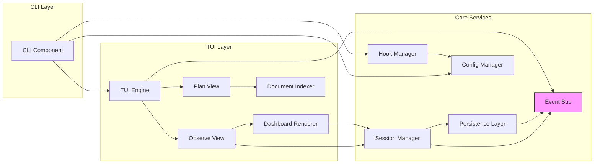

# Components

## CLI Component
**Responsibility:** Command-line interface and entry point for all operations

**Key Interfaces:**
- `spcstr init` - Initialize project with hooks and configuration
- `spcstr run` - Launch TUI application
- `spcstr config` - View/edit configuration
- `spcstr version` - Display version information

**Dependencies:** Cobra framework, Config Manager, Hook Manager

**Technology Stack:** Cobra 1.8.0 for CLI structure, Go 1.21.0

## Hook Manager Component
**Responsibility:** Generate, validate, and install Claude Code hook scripts

**Key Interfaces:**
- GenerateHooks() - Create POSIX-compliant shell scripts
- InstallHooks() - Write hooks to .spcstr/hooks/
- UpdateClaudeSettings() - Modify project's .claude/settings.json

**Dependencies:** Config Manager, File System utilities

**Technology Stack:** Go templates for script generation, encoding/json for settings

## Session Manager Component
**Responsibility:** Manage session lifecycle and state persistence

**Key Interfaces:**
- CreateSession() - Initialize new session
- UpdateSession() - Modify session state
- LoadSession() - Read session from disk
- ListSessions() - Query all sessions
- WatchSessions() - Monitor for changes

**Dependencies:** Persistence Layer, Event Bus

**Technology Stack:** encoding/json for serialization, fsnotify 1.7.0 for watching

## Event Bus Component
**Responsibility:** Coordinate real-time updates between components using channels

**Key Interfaces:**
- Subscribe(topic) - Register for event notifications
- Publish(event) - Emit events to subscribers
- Unsubscribe() - Remove event listener

**Dependencies:** None (core infrastructure)

**Technology Stack:** Go channels, context for cancellation

## Persistence Layer Component
**Responsibility:** Abstract file system operations for session data

**Key Interfaces:**
- Read() - Load JSON from file
- Write() - Save JSON to file
- Delete() - Remove session file
- List() - Enumerate session files
- Watch() - Monitor directory changes

**Dependencies:** File System

**Technology Stack:** encoding/json, os/filepath, fsnotify 1.7.0

## TUI Engine Component
**Responsibility:** Core terminal UI management and view orchestration

**Key Interfaces:**
- Run() - Start TUI event loop
- SwitchView() - Change active view
- HandleKeypress() - Process global keybindings
- Resize() - Handle terminal resize

**Dependencies:** Plan View, Observe View, Event Bus

**Technology Stack:** Bubbletea 0.25.0, Lipgloss 0.9.1

## Plan View Component
**Responsibility:** Document indexing, search, and markdown preview

**Key Interfaces:**
- IndexDocuments() - Scan and catalog markdown files
- SearchDocuments() - Fuzzy search across documents
- RenderMarkdown() - Display formatted markdown
- NavigateDocuments() - Handle document selection

**Dependencies:** Document Indexer, Markdown Renderer

**Technology Stack:** Glamour 0.6.0 for markdown, fuzzy 1.0.0 for search

## Observe View Component
**Responsibility:** Session list and real-time dashboard display

**Key Interfaces:**
- RenderSessionList() - Display active/completed sessions
- RenderDashboard() - Show session details
- HandleSelection() - Process session selection
- UpdateMetrics() - Refresh real-time data

**Dependencies:** Session Manager, Dashboard Renderer

**Technology Stack:** Bubbletea 0.25.0, Bubbles 0.17.1 components

## Dashboard Renderer Component
**Responsibility:** Layout and render session details in organized sections

**Key Interfaces:**
- RenderAgents() - Display agent status section
- RenderTasks() - Show task progress
- RenderFiles() - List file operations
- RenderTools() - Display tool usage metrics
- RenderErrors() - Show error log

**Dependencies:** Session Manager

**Technology Stack:** Lipgloss 0.9.1 for styling, Bubbles 0.17.1 for components

## Document Indexer Component
**Responsibility:** Recursively scan and index planning documents

**Key Interfaces:**
- ScanDirectory() - Recursive markdown discovery
- ClassifyDocument() - Determine document type
- ExtractMetadata() - Parse frontmatter/headers
- BuildIndex() - Create searchable index

**Dependencies:** File System

**Technology Stack:** Go stdlib, regexp for parsing

## Config Manager Component
**Responsibility:** Manage global and project configuration with XDG compliance

**Key Interfaces:**
- LoadConfig() - Read configuration from disk
- SaveConfig() - Persist configuration changes
- MergeConfigs() - Combine global and project settings
- ValidateConfig() - Ensure configuration integrity

**Dependencies:** File System

**Technology Stack:** encoding/json, XDG base directory spec

## Component Diagrams

