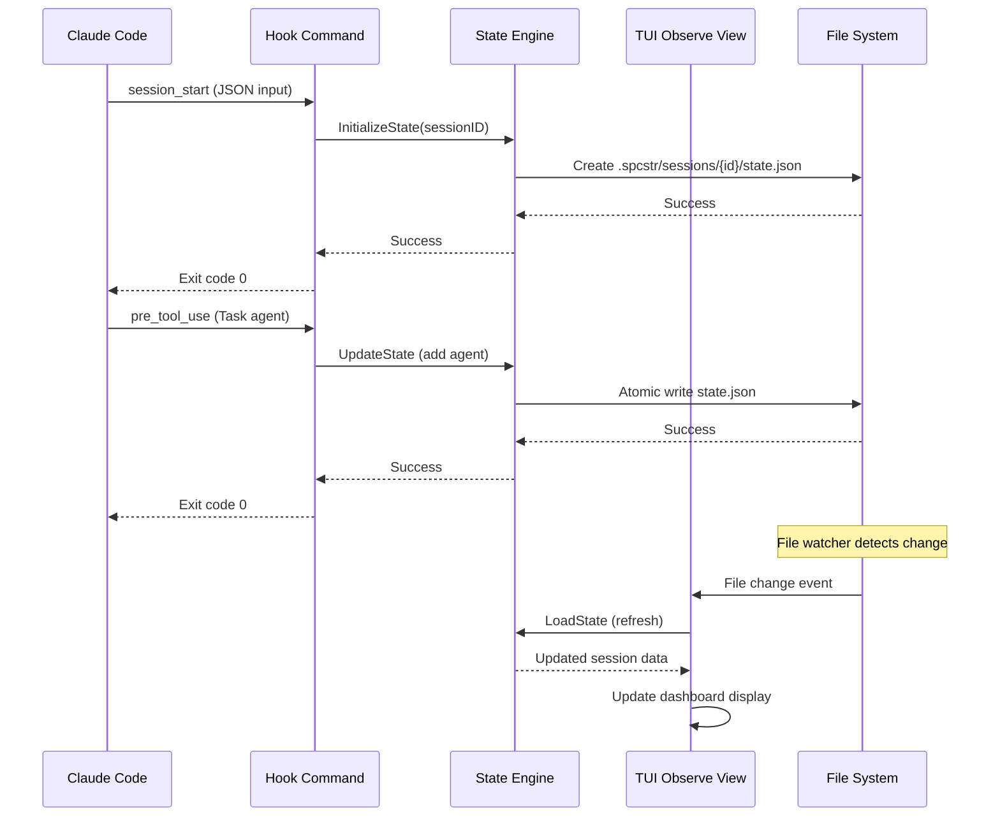
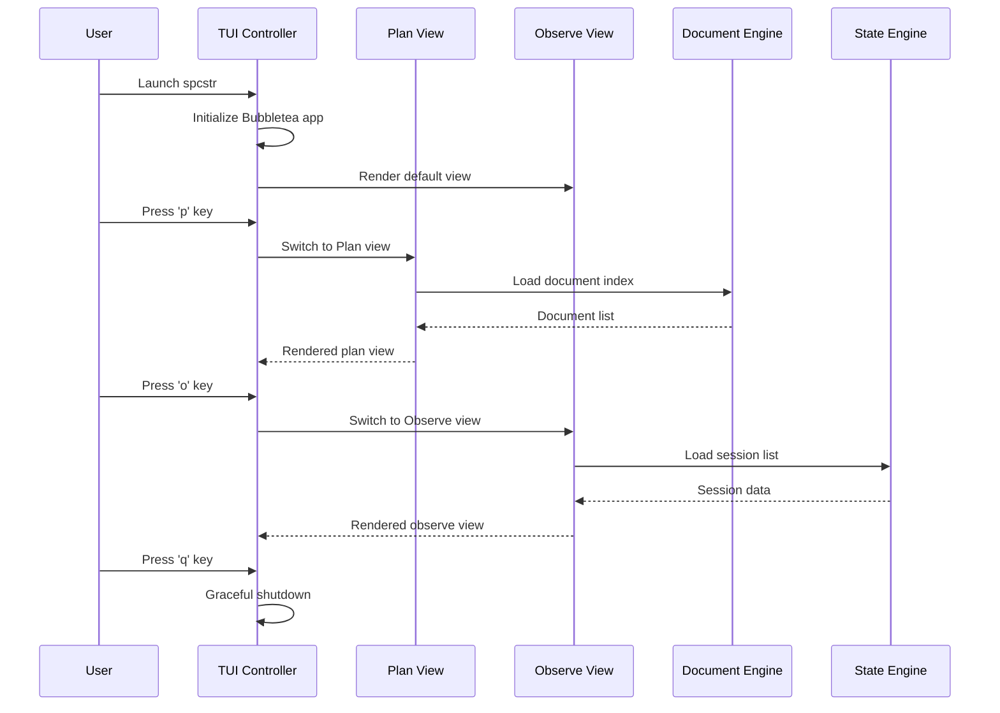
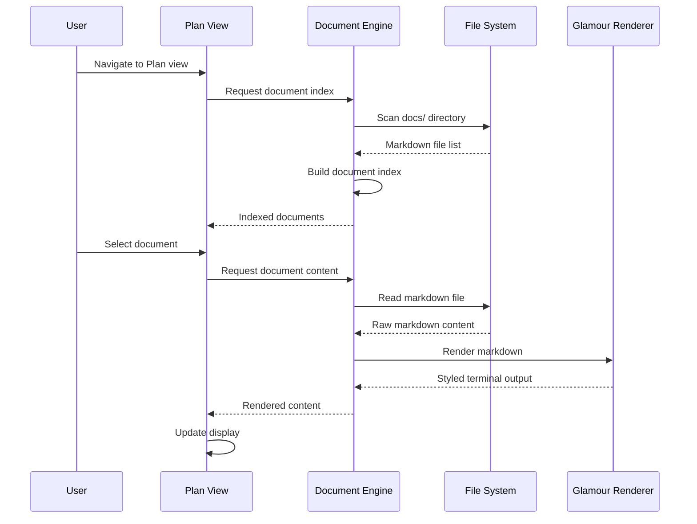

# Core Workflows

## Session Tracking Workflow

```mermaid
sequenceDiagram
    participant CC as Claude Code
    participant Hook as Hook Command
    participant State as State Engine
    participant TUI as TUI Observe View
    participant FS as File System

    CC->>Hook: session_start (JSON input)
    Hook->>State: InitializeState(sessionID)
    State->>FS: Create .spcstr/sessions/{id}/state.json
    FS-->>State: Success
    State-->>Hook: Success
    Hook-->>CC: Exit code 0

    CC->>Hook: pre_tool_use (Task agent)
    Hook->>State: UpdateState (add agent)
    State->>FS: Atomic write state.json
    FS-->>State: Success
    State-->>Hook: Success
    Hook-->>CC: Exit code 0

    Note over FS: File watcher detects change
    FS->>TUI: File change event
    TUI->>State: LoadState (refresh)
    State-->>TUI: Updated session data
    TUI->>TUI: Update dashboard display
```

## TUI Navigation Workflow

```mermaid
sequenceDiagram
    participant User as User
    participant TUI as TUI Controller
    participant Plan as Plan View
    participant Observe as Observe View
    participant Docs as Document Engine
    participant State as State Engine

    User->>TUI: Launch spcstr
    TUI->>TUI: Initialize Bubbletea app
    TUI->>Observe: Render default view

    User->>TUI: Press 'p' key
    TUI->>Plan: Switch to Plan view
    Plan->>Docs: Load document index
    Docs-->>Plan: Document list
    Plan-->>TUI: Rendered plan view

    User->>TUI: Press 'o' key
    TUI->>Observe: Switch to Observe view
    Observe->>State: Load session list
    State-->>Observe: Session data
    Observe-->>TUI: Rendered observe view

    User->>TUI: Press 'q' key
    TUI->>TUI: Graceful shutdown
```

## Document Browser Workflow

```mermaid
sequenceDiagram
    participant User as User
    participant Plan as Plan View
    participant Docs as Document Engine
    participant FS as File System
    participant Glamour as Glamour Renderer

    User->>Plan: Navigate to Plan view
    Plan->>Docs: Request document index
    Docs->>FS: Scan docs/ directory
    FS-->>Docs: Markdown file list
    Docs->>Docs: Build document index
    Docs-->>Plan: Indexed documents

    User->>Plan: Select document
    Plan->>Docs: Request document content
    Docs->>FS: Read markdown file
    FS-->>Docs: Raw markdown content
    Docs->>Glamour: Render markdown
    Glamour-->>Docs: Styled terminal output
    Docs-->>Plan: Rendered content
    Plan->>Plan: Update display
```
