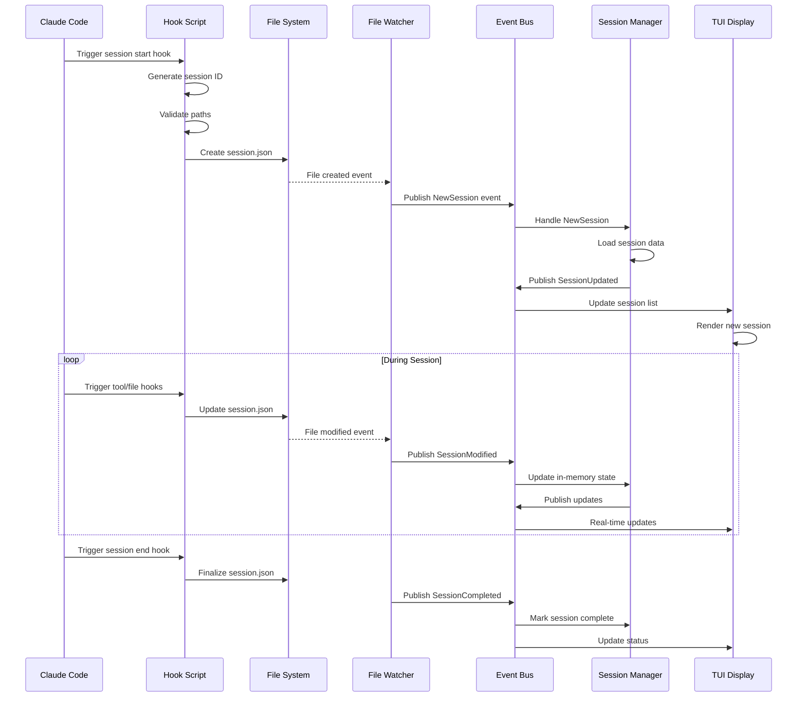
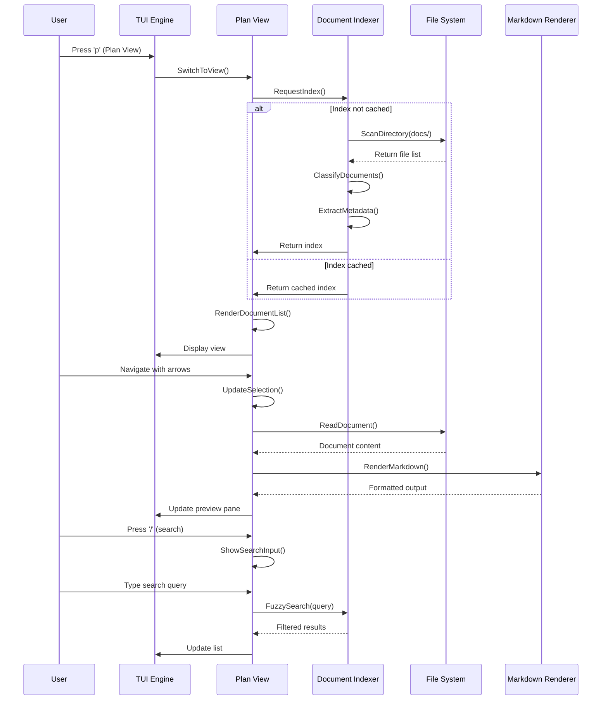
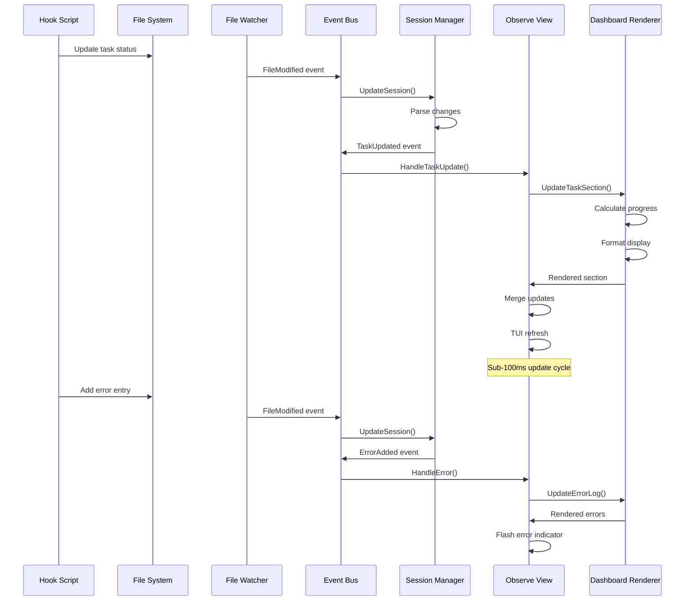
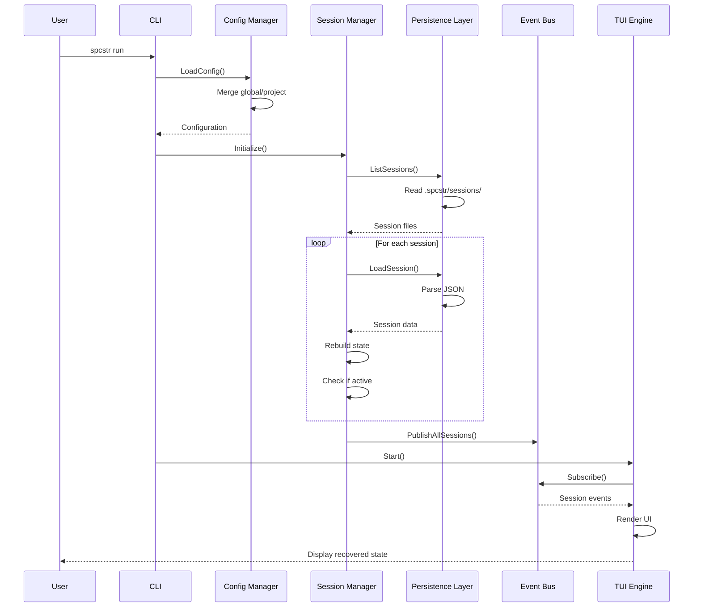
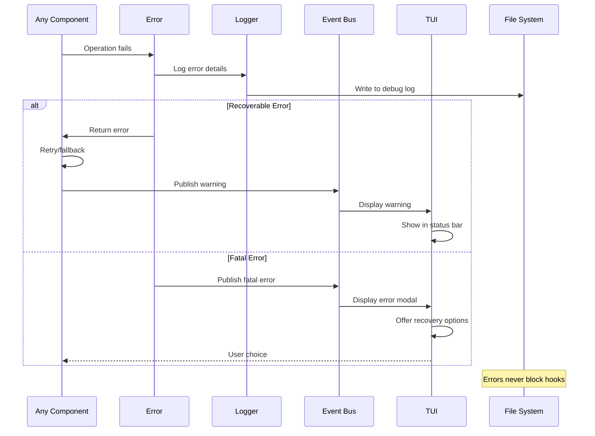

# Core Workflows

## Session Creation and Tracking Workflow

## Plan View Document Discovery Workflow

## Real-time Dashboard Update Workflow

## Session Recovery on Restart Workflow

## Error Handling Flow

