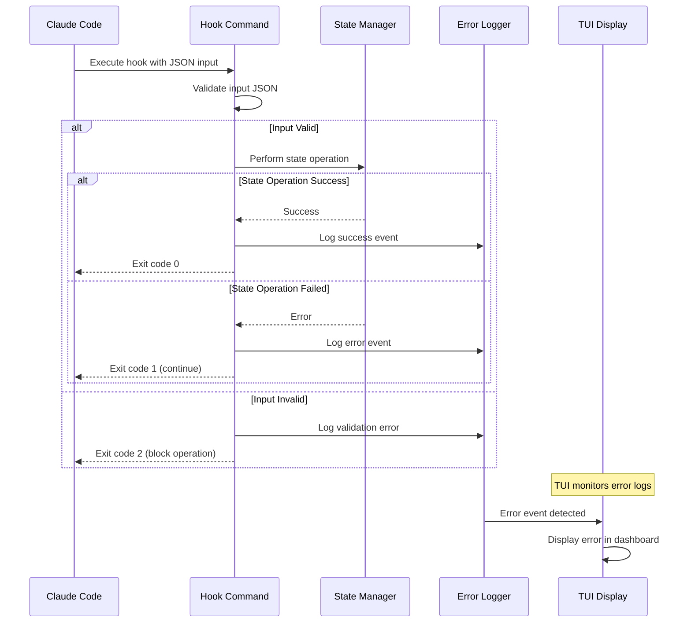

# Error Handling Strategy

## Error Flow



## Error Response Format
```go
// Standard error format for internal operations
type SpcstrError struct {
    Component   string                 `json:"component"`   // "hook", "state", "tui", "docs"
    Operation   string                 `json:"operation"`   // Specific operation that failed
    Message     string                 `json:"message"`     // Human-readable error message
    Code        string                 `json:"code"`        // Error code for programmatic handling
    Context     map[string]interface{} `json:"context"`     // Additional error context
    Timestamp   time.Time              `json:"timestamp"`   // Error occurrence time
    Recoverable bool                   `json:"recoverable"` // Whether operation can be retried
}

func (e SpcstrError) Error() string {
    return fmt.Sprintf("[%s:%s] %s", e.Component, e.Operation, e.Message)
}

// Error codes for different scenarios
const (
    ErrCodeFileNotFound    = "FILE_NOT_FOUND"
    ErrCodeInvalidJSON     = "INVALID_JSON"
    ErrCodeStateCorrupted  = "STATE_CORRUPTED"
    ErrCodeHookTimeout     = "HOOK_TIMEOUT"
    ErrCodePermissionDenied = "PERMISSION_DENIED"
    ErrCodeInvalidInput    = "INVALID_INPUT"
)
```

## Hook Error Handling
```go
// Hook error handler with appropriate exit codes
func (h *BaseHookHandler) handleError(err error) {
    // Log error
    h.logError(err)
    
    // Determine exit code based on error type
    var spcstrErr *SpcstrError
    if errors.As(err, &spcstrErr) {
        switch spcstrErr.Code {
        case ErrCodeInvalidJSON, ErrCodeInvalidInput:
            // Block operation - input is invalid
            os.Exit(2)
        case ErrCodeFileNotFound, ErrCodePermissionDenied:
            // Continue operation - not critical for Claude Code
            os.Exit(0)
        default:
            // General error - continue but log
            os.Exit(1)
        }
    }
    
    // Unknown error - continue with warning
    os.Exit(1)
}

func (h *BaseHookHandler) logError(err error) {
    logEntry := map[string]interface{}{
        "timestamp": time.Now().Format(time.RFC3339),
        "hook_name": h.Name(),
        "error": err.Error(),
    }
    
    // Append to error log file
    logPath := filepath.Join(".spcstr", "logs", "errors.json")
    h.appendToLogFile(logPath, logEntry)
}
```

## TUI Error Handling
```go
// TUI error display component
type ErrorDisplay struct {
    errors   []SpcstrError
    visible  bool
    selected int
}

func (e ErrorDisplay) Update(msg tea.Msg) (tea.Model, tea.Cmd) {
    switch msg := msg.(type) {
    case ErrorMsg:
        e.errors = append(e.errors, msg.Error)
        e.visible = true
        return e, nil
    case tea.KeyMsg:
        if msg.String() == "esc" {
            e.visible = false
        }
        return e, nil
    }
    return e, nil
}

func (e ErrorDisplay) View() string {
    if !e.visible || len(e.errors) == 0 {
        return ""
    }
    
    var content strings.Builder
    content.WriteString("Errors:\n")
    
    for i, err := range e.errors {
        prefix := "  "
        if i == e.selected {
            prefix = "> "
        }
        
        status := "🔴"
        if err.Recoverable {
            status = "🟡"
        }
        
        content.WriteString(fmt.Sprintf("%s%s [%s] %s\n", 
            prefix, status, err.Code, err.Message))
    }
    
    content.WriteString("\nPress 'esc' to close")
    return content.String()
}
```

## State Recovery Handling
```go
// State recovery for corrupted files
func (s *StateManager) LoadStateWithRecovery(sessionID string) (*SessionState, error) {
    statePath := s.getStatePath(sessionID)
    
    // Try normal load
    state, err := s.loadStateFile(statePath)
    if err == nil {
        return state, nil
    }
    
    // Check if file exists but is corrupted
    if _, statErr := os.Stat(statePath); statErr == nil {
        // File exists but couldn't be parsed - try backup
        backupPath := statePath + ".backup"
        if backupState, backupErr := s.loadStateFile(backupPath); backupErr == nil {
            // Restore from backup
            if restoreErr := s.restoreFromBackup(statePath, backupPath); restoreErr == nil {
                return backupState, nil
            }
        }
        
        // No backup or backup failed - create new state with error logging
        s.logCorruptionEvent(sessionID, err)
        return s.initializeEmptyState(sessionID), nil
    }
    
    // File doesn't exist - normal case for new session
    return nil, err
}

func (s *StateManager) createBackupBeforeWrite(statePath string) error {
    if _, err := os.Stat(statePath); err == nil {
        backupPath := statePath + ".backup"
        return s.copyFile(statePath, backupPath)
    }
    return nil // No existing file to backup
}
```
