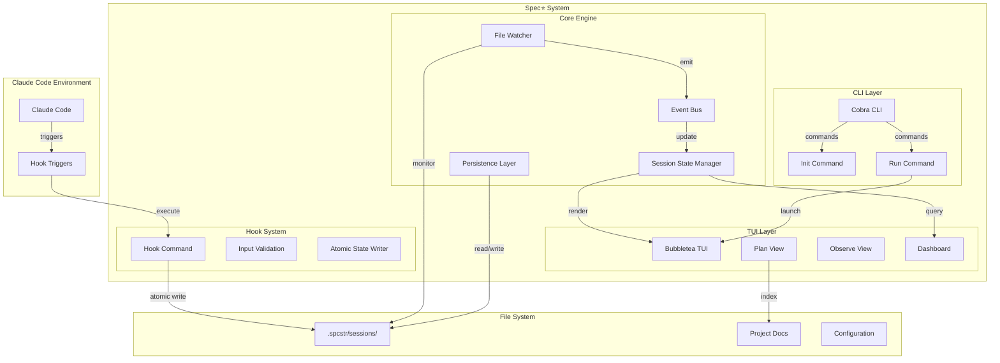

# High Level Architecture

## Technical Summary

Spec⭐️ is a monolithic Go application utilizing an event-driven architecture for real-time session monitoring. The system combines a CLI interface built with Cobra and a responsive TUI powered by Bubbletea, with file-based JSON persistence for session state. Core architectural patterns include event sourcing for session tracking, observer pattern for real-time updates, and command pattern for CLI operations. This architecture directly supports the PRD's goals of sub-100ms responsiveness, single-binary distribution, and seamless Claude Code integration through its hook system.

## High Level Overview

1. **Architectural Style:** Event-Driven Monolith with modular package structure
2. **Repository Structure:** Monorepo containing all Go packages, hook scripts, and configurations (as specified in PRD)
3. **Service Architecture:** Single monolithic Go binary with internal modular packages for separation of concerns
4. **Primary Flow:** Claude Code hooks → Go hook command → Atomic file updates → File system events → Go watchers → Channel-based updates → TUI rendering
5. **Key Decisions:**
   - File-based persistence over database for simplicity and portability
   - Event-driven internal architecture for real-time responsiveness
   - Channel-based communication between components for thread safety
   - Modular package design within monolith for maintainability

## High Level Project Diagram

## Architectural and Design Patterns

- **Event-Driven Architecture:** Internal event bus using Go channels for component communication - _Rationale:_ Enables real-time updates with <100ms latency as required by PRD while maintaining loose coupling
- **Observer Pattern:** File system watchers notify UI of session changes - _Rationale:_ Allows multiple UI components to react to session updates without tight coupling
- **Command Pattern:** Cobra CLI commands encapsulate operations - _Rationale:_ Provides clean separation of CLI interface from business logic, standard Go CLI practice
- **Repository Pattern:** Abstract session data access through interfaces - _Rationale:_ Enables testing with mock data and potential future migration to database if needed
- **Model-View-Update (Elm Architecture):** Bubbletea's pattern for TUI state management - _Rationale:_ Proven pattern for responsive TUIs, handles concurrent updates safely
- **Module Pattern:** Internal packages for session, ui, hooks, config domains - _Rationale:_ Maintains clean boundaries within monolith for future extraction if needed
