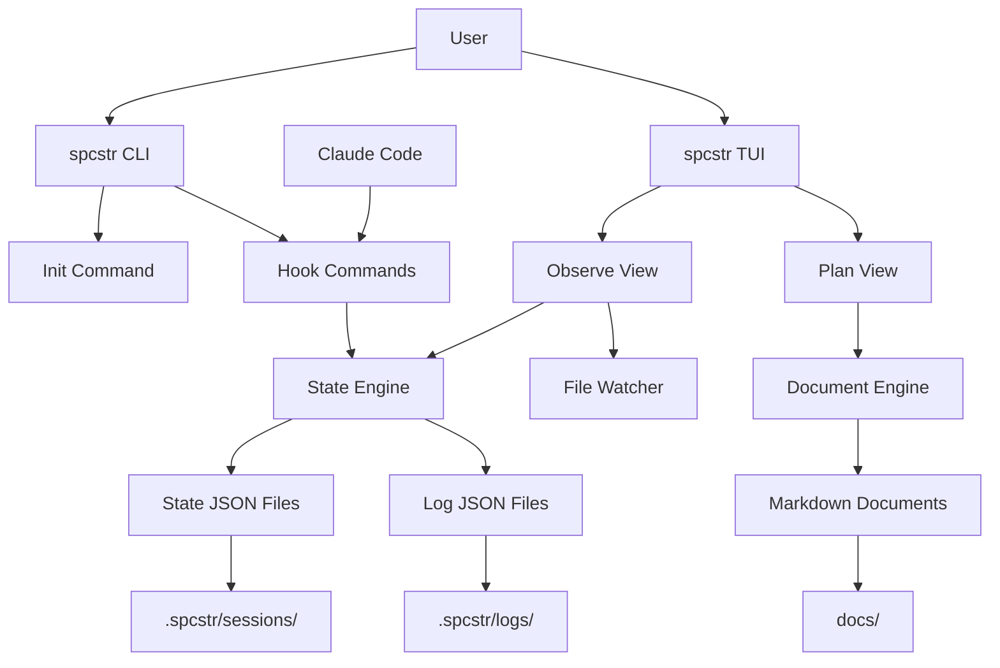

# High Level Architecture

## Technical Summary

The spcstr architecture follows a single-binary monolithic design with embedded hook functionality, combining CLI commands, TUI interface, and real-time file-based observability. The frontend TUI is built with Bubbletea and Lipgloss for cross-platform terminal rendering, while the backend logic handles atomic JSON state management and hook command execution. Integration occurs through filesystem-based communication using `.spcstr/` directory structure with real-time file watching via fsnotify. The system deploys as platform-specific binaries distributed through package managers, eliminating network dependencies while providing comprehensive Claude Code session observability.

## Platform and Infrastructure Choice

**Platform:** Local Development/CLI Distribution  
**Key Services:** Package managers (Homebrew, APT, Pacman), GitHub Releases, Goreleaser  
**Deployment Host and Regions:** Local filesystem - no hosting required

## Repository Structure

**Structure:** Go monorepo with single binary output  
**Monorepo Tool:** Standard Go modules - no additional tooling needed  
**Package Organization:** Clean separation via `cmd/` for binaries and `internal/` for shared packages

## High Level Architecture Diagram

## Architectural Patterns

- **Single Binary Architecture:** All functionality embedded in one executable - _Rationale:_ Eliminates distribution complexity and ensures consistent hook execution environment
- **Event-Driven State Management:** Hook-based updates with atomic file operations - _Rationale:_ Provides reliable session tracking without database dependencies
- **Component-Based TUI:** Reusable Bubbletea components with clear separation - _Rationale:_ Maintains clean code organization for complex terminal interfaces
- **Filesystem-First Integration:** JSON files as primary data persistence - _Rationale:_ Ensures privacy, offline operation, and cross-platform compatibility
- **Real-time Observer Pattern:** File watching with automatic UI updates - _Rationale:_ Provides immediate feedback during active Claude Code sessions
