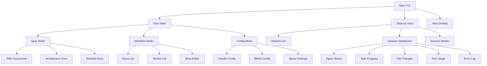
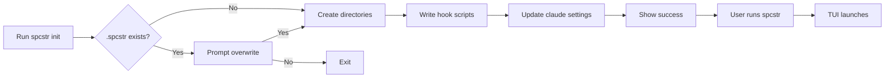
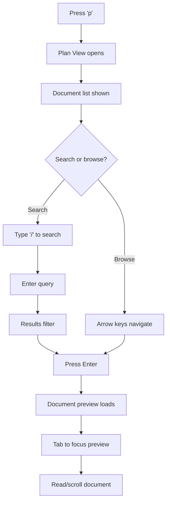
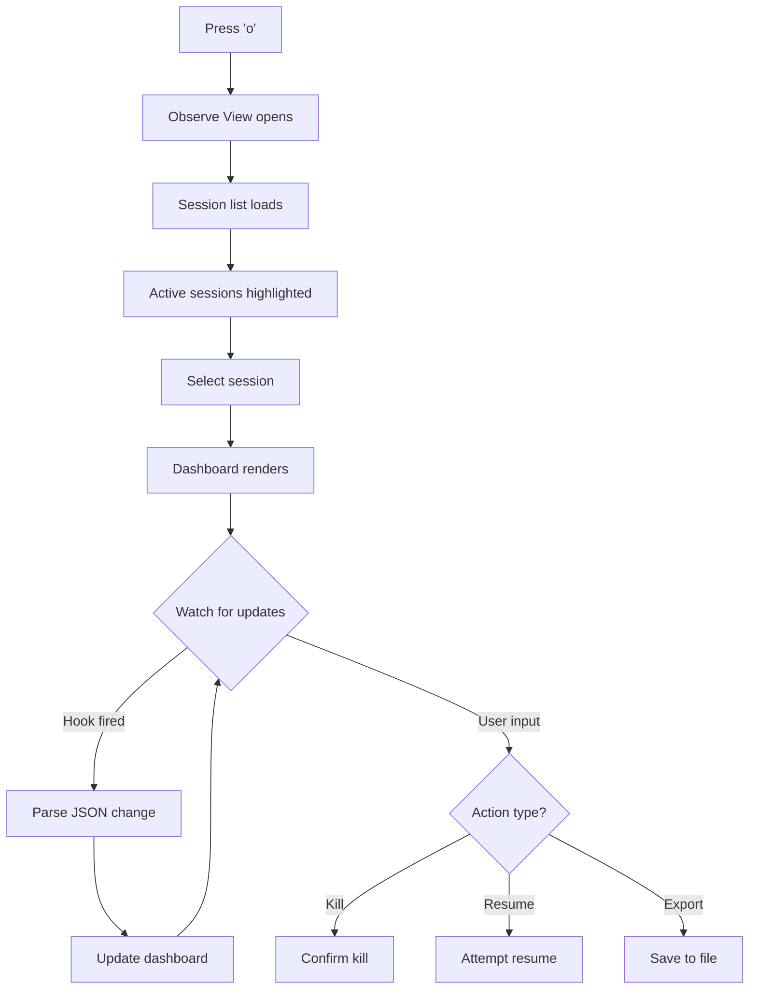

# Spec⭐️ (spcstr) UI/UX Specification

## Introduction

This document defines the user experience goals, information architecture, user flows, and visual design specifications for Spec⭐️'s terminal user interface. It serves as the foundation for TUI development using Bubbletea, ensuring a cohesive and keyboard-centric experience optimized for developer workflows.

### Overall UX Goals & Principles

#### Target User Personas

**Power Developer:** Technical professionals using Claude Code daily who need rapid navigation and maximum information density. They are comfortable with vim-style keybindings and expect sub-second response times.

**Team Lead:** Engineering managers monitoring team progress across multiple sessions. They need high-level dashboards and the ability to drill down into specific session details.

**BMad Practitioner:** Developers following the BMad Method who need seamless integration between planning documents and execution tracking.

#### Usability Goals

- **Instant Feedback:** Every keystroke produces immediate visual response (<16ms)
- **Keyboard Efficiency:** All actions achievable without mouse, with single-key shortcuts for common operations
- **Information Density:** Maximum data visible without scrolling on standard 80x24 terminal
- **Zero Learning Curve:** Familiar vim/tmux patterns for experienced terminal users
- **Progressive Disclosure:** Complex features hidden until needed, discoverable through help system

#### Design Principles

1. **Terminal-Native Excellence** - Respect terminal conventions while pushing boundaries of what's possible in TUI
2. **Keyboard-First Design** - Every feature optimized for keyboard navigation with memorable mnemonics
3. **Real-Time Responsiveness** - Live updates without disrupting user focus or cursor position
4. **Contextual Intelligence** - Show relevant information based on current focus and task
5. **Graceful Degradation** - Function perfectly in minimal terminals while leveraging advanced features when available

### Change Log

| Date | Version | Description | Author |
|------|---------|-------------|--------|
| 2025-09-05 | 1.0 | Initial specification | BMad Master |

## Information Architecture (IA)

### Site Map / Screen Inventory

### Navigation Structure

**Primary Navigation:** Global keybindings (p, o, q) available from any context for view switching. Modal indicators in status bar show current view and available actions.

**Secondary Navigation:** Context-specific keybindings change based on current view and mode. Tab cycles focus between panels. Arrow keys navigate within focused panel.

**Breadcrumb Strategy:** Path display in header shows: View > Mode > Document/Session. Example: "Plan > Spec > docs/prd.md" or "Observe > Session > 6edc20cd"

## User Flows

### Session Initialization Flow

**User Goal:** Initialize spcstr in a new project

**Entry Points:** Command line via `spcstr init`

**Success Criteria:** Project configured with hooks and user can launch TUI

#### Flow Diagram

#### Edge Cases & Error Handling:
- Missing permissions to create directories
- Claude settings.json malformed
- Existing hooks conflict with spcstr hooks
- Terminal too small for TUI

**Notes:** Init command must be idempotent and handle partial installations gracefully

### Document Navigation Flow

**User Goal:** Find and read a specific planning document

**Entry Points:** Press 'p' from any view to enter Plan View

**Success Criteria:** User locates document and can read it within 3 keystrokes

#### Flow Diagram

#### Edge Cases & Error Handling:
- Document file missing or corrupted
- Search returns no results
- Document too large for memory
- Markdown parsing errors

**Notes:** Search should use fuzzy matching and highlight matched terms

### Session Monitoring Flow

**User Goal:** Monitor active Claude Code session in real-time

**Entry Points:** Press 'o' from any view or launch with active session

**Success Criteria:** Dashboard updates within 1 second of any session change

#### Flow Diagram

#### Edge Cases & Error Handling:
- Session file locked by another process
- Rapid updates overwhelming UI
- Session data corrupted
- Network issues with remote sessions

**Notes:** Updates must not move cursor or disrupt user interaction

## Wireframes & Mockups

### Key Screen Layouts

#### Main Dashboard Layout

**Purpose:** Primary interface showing session orchestration status

**Key Elements:**
- Header with session ID, runtime, and mode
- Teams panel showing agent organization
- Active agents list with status indicators
- Sprint board with task columns (Todo/In Progress/Done)
- Activity feed with timestamps

**Interaction Notes:** Focus follows cursor, panels resize based on content, real-time updates with subtle animations

**Design File Reference:** ASCII mockup in original plan document (lines 130-159)

#### Plan View Layout

**Purpose:** Document browser and viewer for planning artifacts

**Key Elements:**
- Left sidebar with hierarchical document tree
- Right panel with markdown preview
- Mode selector in header (Spec/Workflow/Config)
- Search bar accessible via '/'
- Status bar with keybinding hints

**Interaction Notes:** Tab switches focus between panels, Enter opens document, vim-style navigation in preview

**Design File Reference:** Two-panel split similar to file explorers

#### Session List Layout

**Purpose:** Overview of all sessions with selection capability

**Key Elements:**
- Session rows with ID, status, duration, agent count
- Active sessions with pulsing indicator
- Completed sessions with timestamp
- Filter bar for status/date filtering
- Action buttons (Kill/Resume/Export)

**Interaction Notes:** j/k navigation, Enter to select, Ctrl+K to kill, Ctrl+R to resume

**Design File Reference:** Table layout similar to htop/btop

## Component Library / Design System

### Design System Approach

**Design System Approach:** Custom TUI components built with Bubbletea, following terminal UI conventions from tools like vim, tmux, and htop. Components use Lipgloss for styling with consistent color tokens and border styles.

### Core Components

#### Panel Component

**Purpose:** Container for content sections with borders and titles

**Variants:** Single border, double border, rounded corners, no border

**States:** Focused (highlighted border), unfocused (dim border), loading (animated border)

**Usage Guidelines:** Use for major UI sections, ensure proper padding, title should be descriptive

#### List Component

**Purpose:** Scrollable lists for documents, sessions, and tasks

**Variants:** Simple list, numbered list, tree view, table view

**States:** Normal, selected item, filtered, empty state

**Usage Guidelines:** Show scroll position, highlight selected item, support keyboard navigation

#### Status Bar Component

**Purpose:** Persistent footer showing context and available actions

**Variants:** Full width, split sections, minimal

**States:** Normal, alert mode (errors), notification mode

**Usage Guidelines:** Always visible, update based on context, show keybinding hints

#### Progress Indicator Component

**Purpose:** Show task completion and session progress

**Variants:** Bar chart, percentage, spinner, task counter

**States:** Idle, active, completed, error

**Usage Guidelines:** Use for long-running operations, show actual progress not indeterminate

## Branding & Style Guide

### Visual Identity

**Brand Guidelines:** Minimal aesthetic with professional appearance, subtle use of the star emoji (⭐️) as brand element

### Color Palette

| Color Type | Hex/ANSI | Usage |
|------------|----------|-------|
| Primary | Cyan (14) | Active selections, focused borders |
| Secondary | Blue (12) | Links, secondary actions |
| Accent | Yellow (11) | Highlights, important notices |
| Success | Green (10) | Completed tasks, successful operations |
| Warning | Yellow (3) | Warnings, pending items |
| Error | Red (9) | Errors, failed operations |
| Neutral | White/Gray (7/8) | Text, borders, backgrounds |

### Typography

#### Font Families
- **Primary:** System monospace font
- **Secondary:** N/A (terminal constraint)
- **Monospace:** System default terminal font

#### Type Scale

| Element | Size | Weight | Line Height |
|---------|------|--------|-------------|
| H1 | Terminal default | Bold | 1.0 |
| H2 | Terminal default | Bold | 1.0 |
| H3 | Terminal default | Normal | 1.0 |
| Body | Terminal default | Normal | 1.0 |
| Small | Terminal default | Dim | 1.0 |

### Iconography

**Icon Library:** Unicode box-drawing characters, ASCII symbols, emoji for specific branded elements

**Usage Guidelines:** Use sparingly, ensure fallback for limited terminals, maintain consistency across similar functions

### Spacing & Layout

**Grid System:** Flexible grid based on terminal dimensions, typically 80 columns x 24 rows minimum

**Spacing Scale:** Character-based spacing (1 char = 1 unit), consistent 1-char padding in panels, 2-char margins between major sections

## Accessibility Requirements

### Compliance Target

**Standard:** Terminal accessibility through screen reader compatibility and keyboard-only navigation

### Key Requirements

**Visual:**
- Color contrast ratios: Minimum 4.5:1 for all text
- Focus indicators: Clear border highlight on focused elements
- Text sizing: Respects terminal font size settings

**Interaction:**
- Keyboard navigation: Full functionality without mouse
- Screen reader support: Semantic terminal output for screen readers
- Touch targets: N/A (terminal application)

**Content:**
- Alternative text: Status announcements for visual indicators
- Heading structure: Clear hierarchical organization
- Form labels: All inputs clearly labeled

### Testing Strategy

Test with screen readers (NVDA, JAWS), verify keyboard-only navigation, validate in monochrome mode, test in minimal terminals (80x24)

## Responsiveness Strategy

### Terminal Size Adaptations

| Size | Min Cols x Rows | Max Cols x Rows | Adaptation |
|------|-----------------|-----------------|------------|
| Minimal | 80x24 | 119x29 | Single panel focus, hide secondary info |
| Standard | 120x30 | 159x49 | Full two-panel layout |
| Large | 160x50 | - | Additional detail panels, expanded dashboard |

### Adaptation Patterns

**Layout Changes:** Panels stack vertically in narrow terminals, hide sidebars below 100 columns, expand dashboard sections with more space

**Navigation Changes:** Simplified keybindings in minimal mode, additional shortcuts in large terminals

**Content Priority:** Critical information always visible, secondary details progressively revealed, truncate with ellipsis when needed

**Interaction Changes:** Reduce animation in minimal terminals, enable mouse support in capable terminals

## Animation & Micro-interactions

### Motion Principles

Subtle animations that don't distract from content, instant response to user input, smooth transitions between views, respect user's motion preferences

### Key Animations

- **Panel Focus Transition:** Border highlight fades in (Duration: 150ms, Easing: ease-out)
- **List Selection:** Smooth scroll to keep selection centered (Duration: 100ms, Easing: linear)
- **Real-time Updates:** Gentle pulse on changed values (Duration: 500ms, Easing: ease-in-out)
- **Loading Spinner:** Rotating ASCII characters (Duration: 1000ms, Easing: linear)
- **Error Flash:** Brief red background flash (Duration: 200ms, Easing: ease-in)

## Performance Considerations

### Performance Goals

- **TUI Launch:** <500ms from command to interactive
- **Interaction Response:** <16ms for keyboard input
- **Animation FPS:** Consistent 60fps for all animations

### Design Strategies

Lazy load document content, virtual scrolling for long lists, debounce rapid updates, cache rendered components, minimize redraws to changed regions only

## Next Steps

### Immediate Actions

1. Create Bubbletea component prototypes for core UI elements
2. Implement keyboard navigation system with vim bindings
3. Design ASCII art templates for dashboard layouts
4. Test screen reader compatibility with prototype
5. Validate performance with large session files

### Design Handoff Checklist

- [ ] All user flows documented
- [ ] Component inventory complete
- [ ] Accessibility requirements defined
- [ ] Responsive strategy clear
- [ ] Brand guidelines incorporated
- [ ] Performance goals established

## Checklist Results

*To be populated after UX checklist execution*
