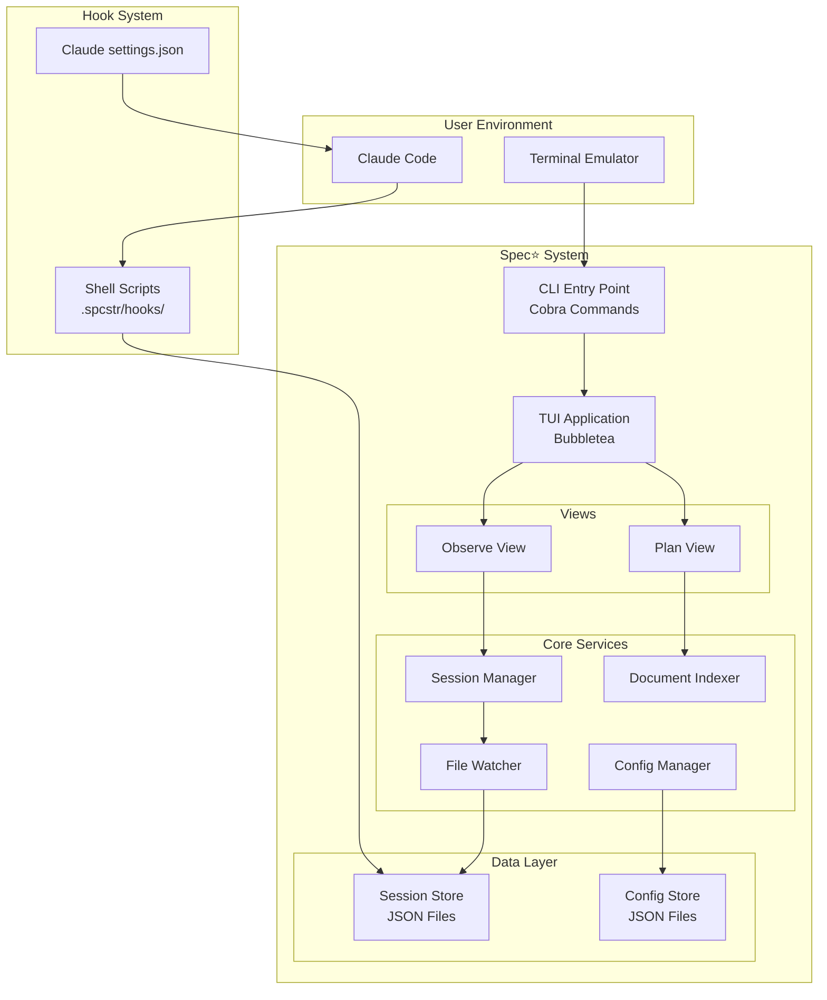
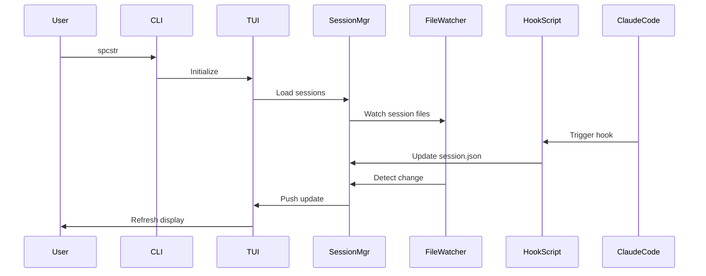
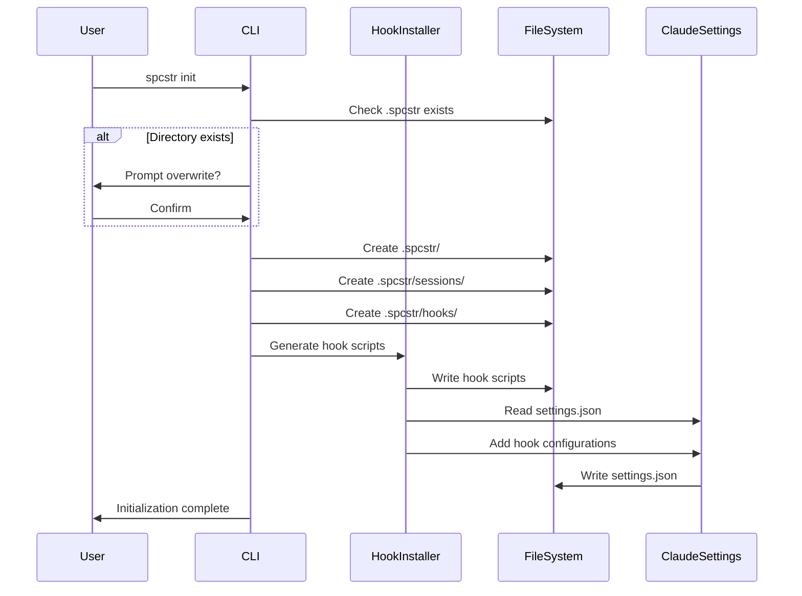
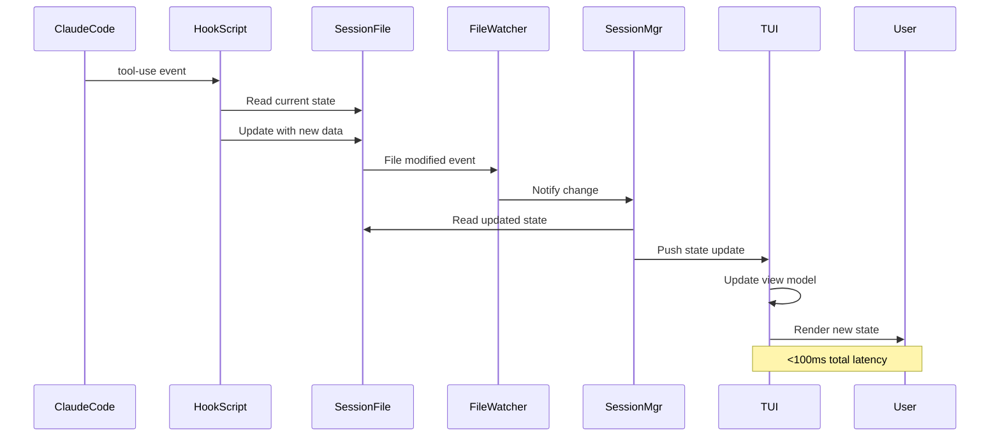
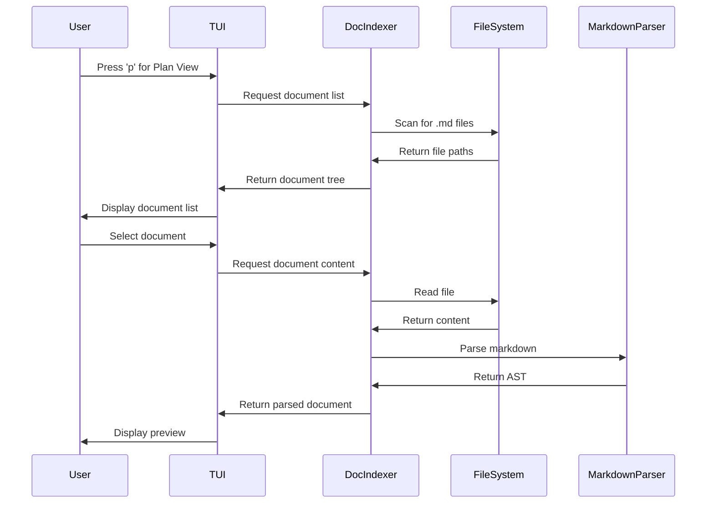
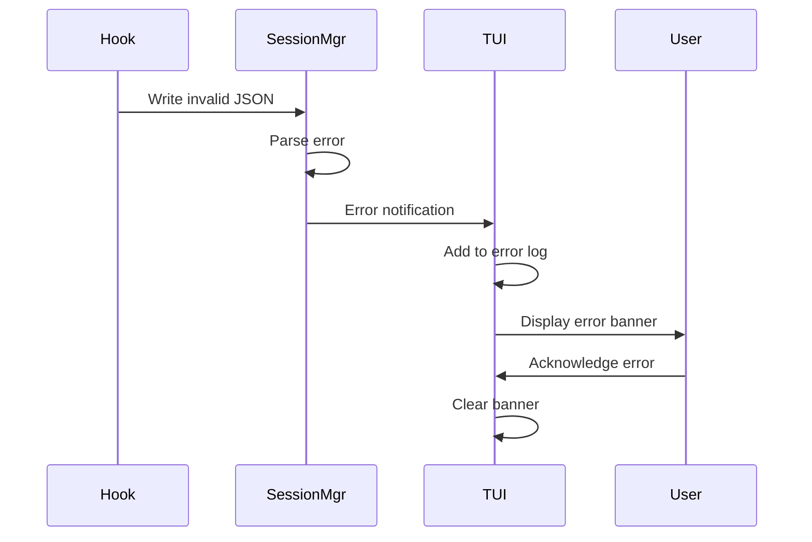

# Spec⭐️ (spcstr) Fullstack Architecture Document

## Introduction

This document outlines the complete architecture for Spec⭐️ (spcstr), including the Go-based TUI application, shell script hooks, and their integration with Claude Code. It serves as the single source of truth for development, ensuring consistency across all components of this terminal-native observability system.

While this is not a traditional web fullstack application, the architecture encompasses both the "frontend" (TUI interface) and "backend" (data persistence, hook processing) concerns in a unified desktop application.

### Starter Template or Existing Project

N/A - Greenfield project

### Change Log

| Date | Version | Description | Author |
|------|---------|-------------|--------|
| 2025-09-05 | 1.0 | Initial architecture | BMad Master |

## High Level Architecture

### Technical Summary

Spec⭐️ is a monolithic Go binary implementing a terminal user interface using the Bubbletea framework for reactive UI updates. The application uses file-based JSON storage for session persistence, with shell scripts acting as lightweight data collectors triggered by Claude Code hooks. The architecture prioritizes sub-100ms response times through event-driven updates via file system watchers. The system is designed for local execution with no network dependencies, compiling to a single binary for easy distribution via standard package managers. This architecture achieves PRD goals of real-time observability and seamless Claude Code integration while maintaining minimal resource overhead.

### Platform and Infrastructure Choice

**Platform:** Local Desktop Environment (Cross-platform)
**Key Services:** File system, Terminal emulator, Shell environment
**Deployment Host and Regions:** User's local machine (macOS, Linux, Windows via WSL)

### Repository Structure

**Structure:** Monorepo with Go modules
**Monorepo Tool:** Go modules with internal packages
**Package Organization:** Separation of concerns with cmd/, internal/, and pkg/ directories

### High Level Architecture Diagram



### Architectural Patterns

- **Model-View-Update (MVU):** Bubbletea's reactive pattern for TUI state management - _Rationale:_ Proven pattern for responsive terminal interfaces with predictable state updates
- **Observer Pattern:** File system watchers for real-time session updates - _Rationale:_ Enables reactive UI updates without polling overhead
- **Repository Pattern:** Abstract file system operations behind interfaces - _Rationale:_ Testability and potential future migration to database storage
- **Command Pattern:** Cobra-based CLI with subcommands - _Rationale:_ Industry standard for Go CLIs with built-in help generation
- **Singleton Pattern:** Single application instance managing TUI lifecycle - _Rationale:_ Prevents resource conflicts and ensures consistent state

## Tech Stack

### Technology Stack Table

| Category | Technology | Version | Purpose | Rationale |
|----------|------------|---------|---------|-----------|
| Language | Go | 1.21+ | Primary implementation language | Performance, single binary, cross-platform |
| CLI Framework | Cobra | v1.8+ | Command-line interface structure | Industry standard with excellent documentation |
| TUI Framework | Bubbletea | v0.25+ | Terminal user interface | Proven reactive TUI with active community |
| Styling Library | Lipgloss | v0.10+ | TUI styling and layout | Seamless Bubbletea integration |
| Data Format | JSON | stdlib v2 | Session state persistence | Human-readable, standard library support |
| Shell Scripts | POSIX sh | - | Hook implementation | Maximum compatibility across systems |
| File Watcher | fsnotify | v1.7+ | Real-time file monitoring | Cross-platform file system events |
| Testing Framework | Go testing | stdlib | Unit and integration tests | Built-in, no dependencies |
| Build Tool | Go build | stdlib | Compilation and packaging | Native Go toolchain |
| Package Manager | Homebrew/apt | - | Distribution | Standard developer tools |
| Version Control | Git | 2.0+ | Source control | Universal standard |
| CI/CD | GitHub Actions | - | Automated testing/release | Free for open source |
| Documentation | Markdown | - | Technical documentation | Universal, Git-friendly |

## Data Models

### Session

**Purpose:** Core data structure tracking Claude Code session state

**Key Attributes:**
- session_id: string - UUID for unique identification
- created_at: timestamp - Session start time
- updated_at: timestamp - Last modification time
- workflow: string - Active BMad workflow name
- agents: []Agent - Currently active agents
- agents_history: []Agent - All agents used in session
- files: FileOperations - Categorized file changes
- tools_used: map[string]int - Tool execution counters
- errors: []Error - Session errors with timestamps

#### Go Struct
```go
type Session struct {
    SessionID      string           `json:"session_id"`
    CreatedAt      time.Time        `json:"created_at"`
    UpdatedAt      time.Time        `json:"updated_at"`
    Source         string           `json:"source"`
    Workflow       string           `json:"workflow"`
    Agents         []Agent          `json:"agents"`
    AgentsHistory  []Agent          `json:"agents_history"`
    Files          FileOperations   `json:"files"`
    ToolsUsed      map[string]int   `json:"tools_used"`
    Errors         []SessionError   `json:"errors"`
}
```

#### Relationships
- Has many Agents (1:N)
- Has one FileOperations structure (1:1)
- Has many Errors (1:N)

### Agent

**Purpose:** Represents an active or historical agent in a session

**Key Attributes:**
- name: string - Agent identifier
- started_at: timestamp - Activation time
- status: string - Current state (active/idle/completed)
- tasks: []Task - Agent's task list

#### Go Struct
```go
type Agent struct {
    Name      string    `json:"name"`
    StartedAt time.Time `json:"started_at"`
    Status    string    `json:"status"`
    Tasks     []Task    `json:"tasks,omitempty"`
}
```

#### Relationships
- Belongs to Session (N:1)
- Has many Tasks (1:N)

### FileOperations

**Purpose:** Categorizes all file operations in a session

**Key Attributes:**
- new: []string - Created files
- edited: []string - Modified files
- read: []string - Accessed files

#### Go Struct
```go
type FileOperations struct {
    New    []string `json:"new"`
    Edited []string `json:"edited"`
    Read   []string `json:"read"`
}
```

#### Relationships
- Belongs to Session (1:1)

### Task

**Purpose:** Represents a task within an agent's workflow

**Key Attributes:**
- id: string - Task identifier
- description: string - Task description
- status: string - todo/in_progress/done
- created_at: timestamp - Task creation time
- completed_at: timestamp - Completion time

#### Go Struct
```go
type Task struct {
    ID          string     `json:"id"`
    Description string     `json:"description"`
    Status      string     `json:"status"`
    CreatedAt   time.Time  `json:"created_at"`
    CompletedAt *time.Time `json:"completed_at,omitempty"`
}
```

#### Relationships
- Belongs to Agent (N:1)

### Configuration

**Purpose:** Application and project settings

**Key Attributes:**
- keybindings: map[string]string - Custom key mappings
- theme: ThemeConfig - Color and style settings
- paths: PathConfig - Directory configurations

#### Go Struct
```go
type Config struct {
    Keybindings map[string]string `json:"keybindings"`
    Theme       ThemeConfig       `json:"theme"`
    Paths       PathConfig        `json:"paths"`
    Version     string            `json:"version"`
}
```

#### Relationships
- Standalone configuration entity

## API Specification

*Note: spcstr is a local TUI application without traditional APIs. However, it defines clear interfaces between components.*

### Internal Component Interfaces

```go
// SessionManager interface for session operations
type SessionManager interface {
    LoadSession(id string) (*Session, error)
    SaveSession(session *Session) error
    ListSessions() ([]SessionSummary, error)
    WatchSession(id string) (<-chan SessionUpdate, error)
    DeleteSession(id string) error
}

// DocumentIndexer interface for document operations
type DocumentIndexer interface {
    IndexDocuments(path string) ([]Document, error)
    SearchDocuments(query string) ([]Document, error)
    GetDocument(path string) (*Document, error)
    WatchDocuments() (<-chan DocumentUpdate, error)
}

// ConfigManager interface for configuration
type ConfigManager interface {
    LoadConfig() (*Config, error)
    SaveConfig(config *Config) error
    GetProjectConfig() (*Config, error)
    GetGlobalConfig() (*Config, error)
}

// HookExecutor interface for hook operations
type HookExecutor interface {
    InstallHooks(projectPath string) error
    ValidateHooks(projectPath string) ([]HookStatus, error)
    UninstallHooks(projectPath string) error
}
```

## Components

### CLI Component

**Responsibility:** Command-line interface entry point and command routing

**Key Interfaces:**
- `spcstr init` - Initialize project with hooks
- `spcstr` - Launch TUI application
- `spcstr --version` - Version information
- `spcstr --help` - Command help

**Dependencies:** Cobra framework, TUI component, Hook component

**Technology Stack:** Go with Cobra CLI framework

### TUI Component

**Responsibility:** Terminal user interface rendering and interaction handling

**Key Interfaces:**
- View switching (Plan/Observe)
- Keyboard event handling
- Screen refresh and layout

**Dependencies:** Bubbletea, Lipgloss, SessionManager, DocumentIndexer

**Technology Stack:** Go with Bubbletea MVU framework

### Session Manager Component

**Responsibility:** Session data persistence and real-time updates

**Key Interfaces:**
- CRUD operations for sessions
- File watching for updates
- JSON serialization/deserialization

**Dependencies:** File system, fsnotify watcher

**Technology Stack:** Go with fsnotify for file watching

### Document Indexer Component

**Responsibility:** Planning document discovery and indexing

**Key Interfaces:**
- Recursive markdown file discovery
- Document search with fuzzy matching
- Document content caching

**Dependencies:** File system, markdown parser

**Technology Stack:** Go with goldmark for markdown parsing

### Hook System Component

**Responsibility:** Claude Code integration through shell scripts

**Key Interfaces:**
- Hook script generation
- Settings.json modification
- Hook validation

**Dependencies:** Shell environment, file system

**Technology Stack:** POSIX shell scripts

### Component Interaction Diagram



## External APIs

*No external APIs required for MVP. Future versions may integrate with:*
- GitHub API for repository information
- Claude Code SDK for enhanced integration

## Core Workflows

### Session Initialization Workflow



### Real-time Session Monitoring Workflow



### Document Navigation Workflow



## Database Schema

*Note: spcstr uses file-based JSON storage instead of traditional databases*

### File System Structure

```
.spcstr/
├── sessions/
│   ├── {session-id}/
│   │   ├── state.json         # Session state
│   │   └── events.jsonl       # Event stream (future)
│   └── index.json             # Session index
├── hooks/
│   ├── startup.sh             # Session start hook
│   ├── tool-use.sh            # Tool execution hook
│   ├── file-edit.sh           # File modification hook
│   └── shutdown.sh            # Session end hook
├── settings.json              # Project configuration
└── cache/
    └── documents.json         # Document index cache
```

### Session State Schema (JSON)

```json
{
  "$schema": "http://json-schema.org/draft-07/schema#",
  "type": "object",
  "required": ["session_id", "created_at", "updated_at"],
  "properties": {
    "session_id": {
      "type": "string",
      "format": "uuid"
    },
    "created_at": {
      "type": "string",
      "format": "date-time"
    },
    "updated_at": {
      "type": "string",
      "format": "date-time"
    },
    "workflow": {
      "type": "string"
    },
    "agents": {
      "type": "array",
      "items": {
        "$ref": "#/definitions/agent"
      }
    },
    "files": {
      "type": "object",
      "properties": {
        "new": {"type": "array", "items": {"type": "string"}},
        "edited": {"type": "array", "items": {"type": "string"}},
        "read": {"type": "array", "items": {"type": "string"}}
      }
    },
    "tools_used": {
      "type": "object",
      "additionalProperties": {"type": "integer"}
    },
    "errors": {
      "type": "array",
      "items": {
        "$ref": "#/definitions/error"
      }
    }
  }
}
```

## TUI Architecture (Frontend Equivalent)

### Component Architecture

#### Component Organization
```
internal/ui/
├── app.go              # Main Bubbletea application
├── models/
│   ├── model.go        # Root application model
│   ├── planview.go     # Plan View model
│   └── observeview.go  # Observe View model
├── views/
│   ├── plan/
│   │   ├── spec.go     # Spec mode view
│   │   ├── workflow.go # Workflow mode view
│   │   └── config.go   # Config mode view
│   └── observe/
│       ├── list.go     # Session list view
│       └── dashboard.go# Session dashboard view
├── components/
│   ├── panel.go        # Panel component
│   ├── list.go         # List component
│   ├── statusbar.go    # Status bar component
│   └── help.go         # Help overlay component
└── styles/
    └── theme.go        # Lipgloss styles
```

#### Component Template
```go
package components

import (
    "github.com/charmbracelet/bubbles/list"
    tea "github.com/charmbracelet/bubbletea"
    "github.com/charmbracelet/lipgloss"
)

type Panel struct {
    title   string
    content string
    focused bool
    style   lipgloss.Style
}

func (p Panel) Init() tea.Cmd {
    return nil
}

func (p Panel) Update(msg tea.Msg) (tea.Model, tea.Cmd) {
    // Handle messages
    return p, nil
}

func (p Panel) View() string {
    return p.style.Render(p.content)
}
```

### State Management Architecture

#### State Structure
```go
type AppModel struct {
    activeView   View
    planView     *PlanViewModel
    observeView  *ObserveViewModel
    config       *Config
    windowSize   tea.WindowSizeMsg
    help         help.Model
    keys         keymap
}

type PlanViewModel struct {
    mode        PlanMode
    documents   []Document
    selected    int
    preview     string
    searching   bool
    searchQuery string
}

type ObserveViewModel struct {
    sessions      []Session
    activeSession *Session
    dashboard     *DashboardModel
    selected      int
}
```

#### State Management Patterns
- Immutable state updates through Bubbletea's Update cycle
- Message-based state changes for predictable updates
- Hierarchical state structure with view-specific models
- Subscription-based updates for file system changes

### View Switching Architecture

#### View Organization
```
Views
├── Global (always active)
│   ├── Keybinding handler
│   ├── Status bar
│   └── Help overlay
├── Plan View
│   ├── Document tree (left panel)
│   ├── Preview (right panel)
│   └── Mode selector
└── Observe View
    ├── Session list (left panel)
    ├── Dashboard (right panel)
    └── Action buttons
```

#### View Switching Handler
```go
func (m AppModel) handleViewSwitch(key string) (AppModel, tea.Cmd) {
    switch key {
    case "p":
        m.activeView = PlanView
        return m, m.planView.Init()
    case "o":
        m.activeView = ObserveView
        return m, m.observeView.Init()
    case "q":
        return m, tea.Quit
    default:
        return m, nil
    }
}
```

## Backend Architecture

### Service Architecture

#### Package Organization
```
internal/
├── session/
│   ├── manager.go      # Session management
│   ├── store.go        # Persistence layer
│   └── watcher.go      # File watching
├── document/
│   ├── indexer.go      # Document indexing
│   ├── search.go       # Search functionality
│   └── cache.go        # Document cache
├── hook/
│   ├── installer.go    # Hook installation
│   ├── scripts.go      # Script templates
│   └── validator.go    # Hook validation
├── config/
│   ├── manager.go      # Config management
│   ├── defaults.go     # Default settings
│   └── validator.go    # Config validation
└── utils/
    ├── filepath.go     # Path utilities
    └── json.go         # JSON helpers
```

#### Service Template
```go
package session

import (
    "encoding/json"
    "fmt"
    "os"
    "path/filepath"
)

type Manager struct {
    basePath string
    watcher  *Watcher
    cache    map[string]*Session
}

func NewManager(basePath string) (*Manager, error) {
    watcher, err := NewWatcher(basePath)
    if err != nil {
        return nil, err
    }
    
    return &Manager{
        basePath: basePath,
        watcher:  watcher,
        cache:    make(map[string]*Session),
    }, nil
}

func (m *Manager) LoadSession(id string) (*Session, error) {
    if cached, ok := m.cache[id]; ok {
        return cached, nil
    }
    
    path := filepath.Join(m.basePath, "sessions", id, "state.json")
    data, err := os.ReadFile(path)
    if err != nil {
        return nil, fmt.Errorf("failed to read session: %w", err)
    }
    
    var session Session
    if err := json.Unmarshal(data, &session); err != nil {
        return nil, fmt.Errorf("failed to parse session: %w", err)
    }
    
    m.cache[id] = &session
    return &session, nil
}
```

### File System Architecture

#### File Watcher Implementation
```go
package session

import (
    "github.com/fsnotify/fsnotify"
)

type Watcher struct {
    watcher *fsnotify.Watcher
    updates chan SessionUpdate
}

func (w *Watcher) Watch(path string) error {
    return w.watcher.Add(path)
}

func (w *Watcher) processEvents() {
    for {
        select {
        case event := <-w.watcher.Events:
            if event.Op&fsnotify.Write == fsnotify.Write {
                w.handleUpdate(event.Name)
            }
        case err := <-w.watcher.Errors:
            // Handle error
        }
    }
}
```

### Hook Script Architecture

#### Hook Script Template
```bash
#!/bin/sh
# tool-use.sh - Claude Code tool use hook

# Configuration
SESSION_DIR=".spcstr/sessions"
SESSION_ID="${CLAUDE_SESSION_ID:-unknown}"
SESSION_FILE="${SESSION_DIR}/${SESSION_ID}/state.json"

# Ensure session directory exists
mkdir -p "${SESSION_DIR}/${SESSION_ID}"

# Initialize session file if not exists
if [ ! -f "${SESSION_FILE}" ]; then
    cat > "${SESSION_FILE}" <<EOF
{
  "session_id": "${SESSION_ID}",
  "created_at": "$(date -u +"%Y-%m-%dT%H:%M:%S.%3NZ")",
  "updated_at": "$(date -u +"%Y-%m-%dT%H:%M:%S.%3NZ")",
  "tools_used": {},
  "files": {"new": [], "edited": [], "read": []},
  "agents": [],
  "errors": []
}
EOF
fi

# Update tool usage count
TOOL_NAME="${1:-unknown}"
jq --arg tool "${TOOL_NAME}" \
   '.tools_used[$tool] = ((.tools_used[$tool] // 0) + 1) | 
    .updated_at = now | todate' \
   "${SESSION_FILE}" > "${SESSION_FILE}.tmp" && \
   mv "${SESSION_FILE}.tmp" "${SESSION_FILE}"
```

## Unified Project Structure

```
spcstr/
├── .github/                    # CI/CD workflows
│   └── workflows/
│       ├── test.yaml           # Test workflow
│       ├── build.yaml          # Build workflow
│       └── release.yaml        # Release workflow
├── cmd/
│   └── spcstr/                 # Main application entry
│       └── main.go
├── internal/                   # Private packages
│   ├── cli/                    # CLI commands
│   │   ├── root.go
│   │   └── init.go
│   ├── ui/                     # TUI components
│   │   ├── app.go
│   │   ├── models/
│   │   ├── views/
│   │   └── components/
│   ├── session/                # Session management
│   │   ├── manager.go
│   │   └── watcher.go
│   ├── document/               # Document handling
│   │   ├── indexer.go
│   │   └── search.go
│   ├── hook/                   # Hook management
│   │   ├── installer.go
│   │   └── scripts.go
│   └── config/                 # Configuration
│       └── manager.go
├── pkg/                        # Public packages
│   └── types/                  # Shared types
│       ├── session.go
│       └── config.go
├── scripts/                    # Build/install scripts
│   ├── install.sh
│   └── build.sh
├── templates/                  # Hook script templates
│   ├── startup.sh.tmpl
│   ├── tool-use.sh.tmpl
│   └── file-edit.sh.tmpl
├── testdata/                   # Test fixtures
├── docs/                       # Documentation
│   ├── prd.md
│   ├── project-brief.md
│   ├── front-end-spec.md
│   └── fullstack-architecture.md
├── go.mod                      # Go module definition
├── go.sum                      # Dependency checksums
├── Makefile                    # Build automation
├── .goreleaser.yml            # Release configuration
└── README.md                   # Project documentation
```

## Development Workflow

### Local Development Setup

#### Prerequisites
```bash
# Install Go 1.21+
brew install go

# Install development tools
go install github.com/golangci/golangci-lint/cmd/golangci-lint@latest
go install github.com/goreleaser/goreleaser@latest
```

#### Initial Setup
```bash
# Clone repository
git clone https://github.com/yourusername/spcstr
cd spcstr

# Install dependencies
go mod download

# Build application
make build

# Run tests
make test
```

#### Development Commands
```bash
# Start development (with hot reload)
make dev

# Run application
./bin/spcstr

# Run specific command
./bin/spcstr init

# Run tests
make test

# Run linter
make lint

# Generate release
make release
```

### Environment Configuration

#### Required Environment Variables
```bash
# Development (.env.local)
SPCSTR_DEBUG=true
SPCSTR_LOG_LEVEL=debug

# Testing (.env.test)
SPCSTR_TEST_MODE=true
SPCSTR_TEST_DIR=/tmp/spcstr-test

# Production (typically none required)
# All configuration via files
```

## Deployment Architecture

### Deployment Strategy

**Binary Distribution:**
- **Platform:** GitHub Releases
- **Build Command:** `goreleaser build`
- **Output Directory:** `dist/`
- **Architectures:** darwin/amd64, darwin/arm64, linux/amd64, linux/arm64

**Package Manager Distribution:**
- **Platform:** Homebrew (macOS), apt (Linux)
- **Build Command:** `make package`
- **Deployment Method:** Formula/package submission

### CI/CD Pipeline
```yaml
# .github/workflows/release.yaml
name: Release

on:
  push:
    tags:
      - 'v*'

jobs:
  release:
    runs-on: ubuntu-latest
    steps:
      - uses: actions/checkout@v4
      - uses: actions/setup-go@v5
        with:
          go-version: '1.21'
      
      - name: Run tests
        run: make test
      
      - name: Build releases
        uses: goreleaser/goreleaser-action@v5
        with:
          version: latest
          args: release --clean
        env:
          GITHUB_TOKEN: ${{ secrets.GITHUB_TOKEN }}
```

### Environments

| Environment | Binary Location | Config Location | Purpose |
|------------|-----------------|-----------------|---------|
| Development | `./bin/spcstr` | `./.spcstr/` | Local development |
| Testing | `/tmp/test/spcstr` | `/tmp/test/.spcstr/` | Automated testing |
| Production | `/usr/local/bin/spcstr` | `~/.spcstr/` or project `.spcstr/` | End user installation |

## Security and Performance

### Security Requirements

**Application Security:**
- File Permissions: Respect user umask for created files
- Path Traversal Prevention: Validate all file paths
- Shell Injection Prevention: No user input in shell commands

**Hook Security:**
- Script Validation: Verify hook scripts before execution
- Sandboxing: Scripts run with minimal permissions
- No Network Access: Hooks cannot make network calls

**Data Security:**
- Local Storage Only: No cloud sync in MVP
- No Sensitive Data: Avoid storing credentials
- User Privacy: No telemetry or analytics

### Performance Optimization

**TUI Performance:**
- Response Time Target: <16ms for keyboard input
- Rendering Strategy: Differential updates only
- Memory Usage: <10MB baseline, <1MB per session

**File System Performance:**
- Indexing Cache: In-memory document cache
- Watch Debouncing: Batch rapid file changes
- Lazy Loading: Load session details on demand

## Testing Strategy

### Testing Pyramid

```
        E2E Tests
        /        \
    Integration Tests
    /              \
Component Tests   System Tests
/              \
Unit Tests    Benchmark Tests
```

### Test Organization

#### Unit Tests
```
internal/
├── session/
│   ├── manager_test.go
│   └── watcher_test.go
├── document/
│   ├── indexer_test.go
│   └── search_test.go
└── hook/
    └── installer_test.go
```

#### Integration Tests
```
tests/
├── integration/
│   ├── session_test.go
│   ├── document_test.go
│   └── hook_test.go
└── e2e/
    ├── init_test.go
    └── tui_test.go
```

### Test Examples

#### Unit Test Example
```go
func TestSessionManager_LoadSession(t *testing.T) {
    tmpDir := t.TempDir()
    manager, err := NewManager(tmpDir)
    require.NoError(t, err)
    
    // Create test session
    session := &Session{
        SessionID: "test-123",
        CreatedAt: time.Now(),
    }
    
    err = manager.SaveSession(session)
    require.NoError(t, err)
    
    // Load and verify
    loaded, err := manager.LoadSession("test-123")
    require.NoError(t, err)
    assert.Equal(t, session.SessionID, loaded.SessionID)
}
```

#### Integration Test Example
```go
func TestHookIntegration(t *testing.T) {
    tmpDir := t.TempDir()
    
    // Initialize project
    err := RunCommand("init", tmpDir)
    require.NoError(t, err)
    
    // Verify hooks installed
    hookPath := filepath.Join(tmpDir, ".spcstr/hooks/tool-use.sh")
    assert.FileExists(t, hookPath)
    
    // Simulate hook execution
    err = ExecuteHook(hookPath, "TestTool")
    require.NoError(t, err)
    
    // Verify session updated
    sessions, err := ListSessions(tmpDir)
    require.NoError(t, err)
    assert.Len(t, sessions, 1)
}
```

## Coding Standards

### Critical Go Development Rules

- **Error Handling:** Always check and handle errors explicitly, never ignore with `_`
- **Context Usage:** Pass context.Context as first parameter for cancellation support
- **Interface Design:** Accept interfaces, return concrete types
- **Goroutine Safety:** Protect shared state with mutexes or channels
- **Resource Cleanup:** Always defer Close() after checking error on Open()
- **JSON Tags:** Include json tags on all exported struct fields
- **Package Organization:** Keep packages focused with clear boundaries

### Naming Conventions

| Element | Convention | Example |
|---------|------------|---------|
| Package | lowercase | `session` |
| Interface | PascalCase with suffix | `SessionManager` |
| Struct | PascalCase | `Session` |
| Function | PascalCase (exported) | `LoadSession` |
| Function | camelCase (private) | `loadFromFile` |
| Constant | PascalCase | `MaxSessions` |
| File | snake_case | `session_manager.go` |

## Error Handling Strategy

### Error Flow



### Error Types
```go
type SessionError struct {
    Code      string    `json:"code"`
    Message   string    `json:"message"`
    Timestamp time.Time `json:"timestamp"`
    Context   map[string]interface{} `json:"context,omitempty"`
}

// Error codes
const (
    ErrCodeParse     = "PARSE_ERROR"
    ErrCodeFileIO    = "FILE_IO_ERROR"
    ErrCodeHook      = "HOOK_ERROR"
    ErrCodeConfig    = "CONFIG_ERROR"
)
```

### TUI Error Handling
```go
func (m Model) handleError(err error) (Model, tea.Cmd) {
    sessionErr := &SessionError{
        Code:      ErrCodeParse,
        Message:   err.Error(),
        Timestamp: time.Now(),
    }
    
    m.errors = append(m.errors, sessionErr)
    m.showErrorBanner = true
    
    return m, tea.Tick(5*time.Second, func(t time.Time) tea.Msg {
        return clearErrorMsg{}
    })
}
```

## Monitoring and Observability

### Monitoring Stack

- **Application Metrics:** Internal metrics via expvar (optional)
- **Error Tracking:** Local error log in `.spcstr/errors.log`
- **Performance Monitoring:** Built-in benchmarks via `go test -bench`
- **Debug Mode:** Verbose logging when SPCSTR_DEBUG=true

### Key Metrics

**Application Metrics:**
- TUI frame rate (target: 60fps)
- Session load time (target: <100ms)
- Memory usage (target: <10MB baseline)
- File watcher latency (target: <100ms)

**Usage Metrics:**
- Sessions created per day
- Most used tools
- Average session duration
- Error frequency by type

## Checklist Results Report

*To be populated after architect checklist execution*